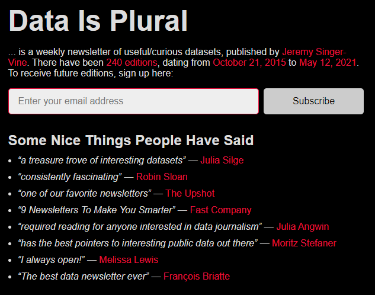
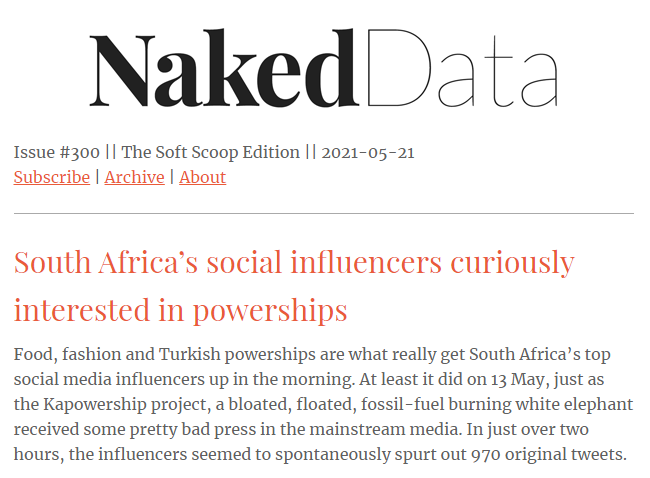
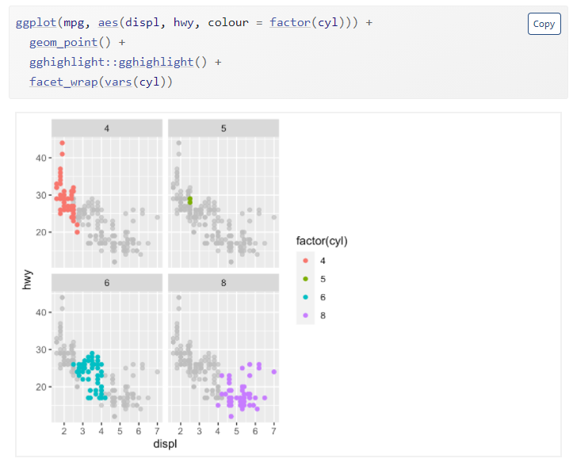
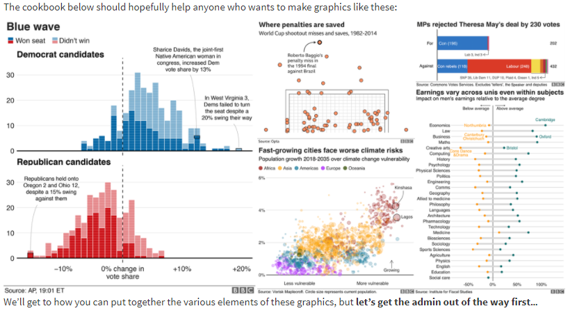
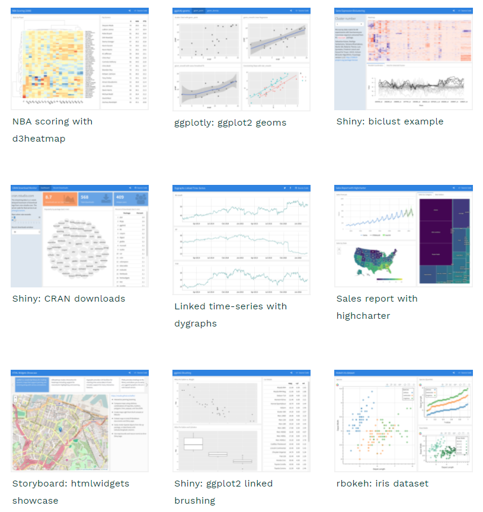

```{r setup, include=FALSE}
knitr::opts_chunk$set(echo = TRUE)

library(tidyverse)
library(xaringan)
library(xaringanExtra)

xaringanExtra::use_panelset()
```

## Purpose

Data visualisation is super fun and a great tool for communication. I have put together [some slides](https://j-jayes.github.io/data-viz-workshop/) for talk on data visualisation for economic historians at the [Laboratory for the Economics of Africa's Past](https://leapstellenbosch.org.za/). These resources are collected here to help when you think 'where do I start with R?'.

I hope that you find these resources useful. They are divided up into different sections in the tabs below.

### Why use R?

There are a multitude of different pieces of software and different workflows that you can use to create beautiful and intelligible data visualizations.

I think R is a very good choice. There are three reasons I love R for data viz.

1. `ggplot2` is a fantastic library for making data visualizations - it is customizable and logical. 
2. The [R community](https://twitter.com/rstatstweet?lang=en) is very supportive and makes learning and improving a pleasure.
3. The entire process of importing and cleaning data, visualizing it, and then sharing it is made easy in [Rstudio](https://www.rstudio.com/).

## Resources

In the tabs below, I have collected some resources that I hope will be beneficial on your journey.

::::: {.panelset}


::: {.panel}
[Installing R]{.panel-name}

# Getting started

Before we can do the fun stuff, we need to install R and RStudio.

The [Modern Dive textbook](https://moderndive.com) has a great primer on [getting started in R](https://moderndive.com/1-getting-started.html) with an explanation of the difference between R and RStudio:


The Rstudio Education team also have a great [beginner guide](https://education.rstudio.com/learn/beginner/) to R that covers installation.

:::

::: {.panel}
[Learning R]{.panel-name}

# Videos and textbooks for learning how to use R

### The R bible

The definitive guide to using R in a modern manner is [R for Data Science](https://r4ds.had.co.nz/) by Hadley Wickham and Garrett Grolemund. I am not sure that is the best place to start, but it is certainly a helpful resource to come back to once you're up and running.


### RStudio Education

[Rstudio Education](https://education.rstudio.com/learn/beginner/) have put together a set of instructions for learning R at different levels of competency. These include great guides for installing R, R Studio and the `tidyverse` packages right at the beginning.

The [beginner](https://education.rstudio.com/learn/beginner/), [intermediate](https://education.rstudio.com/learn/intermediate/) and [expert](https://education.rstudio.com/learn/expert/) start guides are linked here.

The RStudio team have put a lot of effort into creating resources that are useful for many R users, from [helping teachers take their course work online](https://www.rstudio.com/resources/webinars/sharing-on-short-notice-how-to-get-your-materials-online-with-r-markdown/), to [financial analysis](http://www.reproduciblefinance.com/), to [creating a personal website](https://education.rstudio.com/blog/2021/02/distill-it-down/) and [academic publishing](https://rstudio.github.io/distill/). Have a look around [their website](https://www.rstudio.com/resources/webinars/) for more.


### Other great video resources

I am a visual learner and as a consequence I like to watch how things are done and copy them. Because Youtube allows for pausing and recapping at your own pace, I think this is a great way to learn. I've collected some videos in these resources which I think are a good place to start.

[David Robinson's Youtube Channel](https://youtu.be/tCa2di7aEP4)

David Robinson does a weekly screencast where he shows how to do exploratory data analysis and makes plots in R.

Here is a video about analysing text from reviews of ramen noodles. It has some useful tips for drawing tie-fighter plots and interpreting linear regressions.

<iframe width="560" height="315" src="https://www.youtube.com/embed/tCa2di7aEP4?controls=0" title="YouTube video player" frameborder="0" allow="accelerometer; autoplay; clipboard-write; encrypted-media; gyroscope; picture-in-picture" allowfullscreen></iframe>

He also has a [talk](https://www.youtube.com/watch?v=NDHSBUN_rVU) about tricks in the `tidyverse`.

<iframe width="560" height="315" src="https://www.youtube.com/embed/NDHSBUN_rVU?controls=0" title="YouTube video player" frameborder="0" allow="accelerometer; autoplay; clipboard-write; encrypted-media; gyroscope; picture-in-picture" allowfullscreen></iframe>

[Julia Silge's blog](https://juliasilge.com/blog/hawaii-post-offices/)

Julia Silge's blog is mostly about doing modelling in R, and text modelling in particular. It is a very useful place to look if you want to understand the tidymodels framework which provides access to a host of machine learning techniques in a very easy to use manner. She also has a [Youtube channel](https://www.youtube.com/watch?v=RA5SyY-s-AA&feature=emb_imp_woyt).

Here is a video from Julia looking at sentiment analysis in R:

<iframe width="560" height="315" src="https://www.youtube.com/embed/whE85O1XCkg?controls=0" title="YouTube video player" frameborder="0" allow="accelerometer; autoplay; clipboard-write; encrypted-media; gyroscope; picture-in-picture" allowfullscreen></iframe>

[The tidy text mining textbook](https://www.tidytextmining.com/)

Written by Julia Silge and David Robinson, this book gives a lovely introduction to text mining in R. It has lots of examples and includes all the code necessary. As a bonus it is free!


[Andrew Couch's Youtube Channel](https://www.youtube.com/c/AndrewCouch/featured) has a marvelous set of walk throughs of innovative and exciting packages in R. He's a young data scientist who is creating fantastic content focussed on R and the `tidyverse`.

Here is one of his videos on creating functions with the `tidyverse`.

<iframe width="560" height="315" src="https://www.youtube.com/embed/7oz1qGClrl0?controls=0" title="YouTube video player" frameborder="0" allow="accelerometer; autoplay; clipboard-write; encrypted-media; gyroscope; picture-in-picture" allowfullscreen></iframe>

### Another resource collection!

The [LearnR4Free website](https://www.learnr4free.com/en/index.html) compiled by [Mine Dogucu](https://twitter.com/MineDogucu) has a great set of resources that are free to use for the learner.

:::

::: {.panel}
[Datasets]{.panel-name}

# Useful sources of data to practice your skills on

Having great datasets available helps to keep me interested in learning new skills. Here are three sources of interesting data:

[The Tidy Tuesday Project](https://github.com/rfordatascience/tidytuesday)

Tidy Tuesday is a project run by the R for Data Science foundation - each week they share a real world data set and encourage R users to practice their skills. It has a really fantastic community aspect and if you share your work on Twitter people are always helpful and kind. Others share their work and their code so you can see how their plots were made.
In their words, 
<blockquote>
The intent of Tidy Tuesday is to provide a safe and supportive forum for individuals to practice their wrangling and data visualization skills independent of drawing conclusions.
</blockquote>


[Data is Plural](https://www.data-is-plural.com/)

"Data is Plural is a weekly newsletter of useful/curious datasets, published by Jeremy Singer-Vine". This sums it up - really interesting stuff from all over the internet.



[Naked Data](https://nakeddata.org/)

"Naked Data is a weekly newsletter which rounds up the best in data-driven storytelling created in or about the Global South." Get the best bits of twitter without having to spend all day scrolling. Really great newsletter based in SA.



:::

::: {.panel}
[Visualization]{.panel-name}

# Great places to get inspiration, figures and code from

### Fundementals of data visualization

There are many books on the theory and practice of data visualization. I think [Fundamentals of Data Visualization](https://clauswilke.com/dataviz/) by [Claus Wilke](https://clauswilke.com/) is an excellent choice to start with. The preface reads:

<blockquote cite="https://clauswilke.com/dataviz/preface.html">
If you are a scientist, an analyst, a consultant, or anybody else who has to prepare technical documents or reports, one of the most important skills you need to have is the ability to make compelling data visualizations, generally in the form of figures. Figures will typically carry the weight of your arguments. They need to be clear, attractive, and convincing.
</blockquote>

The book provides great advice for matching your data to a good chart type. For how to make the chosen chart in R, have a look at his course, linked below.


### The best course in data viz

[Clause Wilke's Course on Data Visualization in R](https://wilkelab.org/SDS375/syllabus.html) is a fantastic accompaniment to the book linked above. The description reads:

<blockquote cite="https://wilkelab.org/SDS375/syllabus.html">
In this class, students will learn how to visualize data sets and how to reason about and communicate with data visualizations. A substantial component of this class will be dedicated to learning how to program in R. In addition, students will learn how to compile analyses and visualizations into reports, how to make the reports reproducible, and how to post reports on a website or blog.
</blockquote>

It has wonderful sets of slides including this [delightful primer on visualizing uncertainty](https://wilkelab.org/SDS375/slides/visualizing-uncertainty.html#1), and accompnaying code that can be downloaded and worked through. Bonus: all of the slides are hosted on github such that you can see how they're put together.

### The ggplot2 bible

The definitive guide to `ggplot2`, [The ggplot2 Book](https://ggplot2-book.org/index.html) is a fantastic resource for novices and experts alike. It is easy to navigate and has helpful examples with code used to create each figure. (I love to consult the section on [annotations](https://ggplot2-book.org/annotations.html) as I never remember exactly how they work for some reason.)



### Other great viz resources

The [Storytelling with Data](https://www.storytellingwithdata.com/blog) blog has an excellent selection of articles that give tips and tricks on how to design graphics that are easy to understand.

Their [Chart Guide](https://www.storytellingwithdata.com/chart-guide) is also a fantastic starting point for how to pick a chart.


[Jonathan Tan's exploration of Household Solar Energy in the US](https://jtanwk.github.io/us-solar/) is an amazing data storytelling piece that shows all of the code required to create each figure. It makes great use of annotations to explain each component of the visualizations. 


[The R Graph Gallery](https://www.r-graph-gallery.com/) is a useful website which showcases different kinds of visualizations and provides the code that you need to use to recreate the figure yourself.


:::

::: {.panel}
[Custom themes]{.panel-name}

# For style that is consistent and graphics that are clear

If you want to create a style of graphics that communicate clearly to the general public (or are consistent across your organization), have a look at the [BBC Visual and Data Journalism cookbook for R graphics](https://bbc.github.io/rcookbook/). The guide is filled with fantastic examples of visualizations you might like to emulate, and code to do so. They also walk through customizing fonts, colours and annotations for consistency over time.



If you want to create your own theme, Thomas Mock has [a lovely guide](https://themockup.blog/posts/2020-12-26-creating-and-using-custom-ggplot2-themes/) on graphs that communicate well and look good.

He walks through a great example of where adding custom images on the plot makes sense:


:::

::: {.panel}
[Aesthetics]{.panel-name}

# If you're interested in learning more about how to make your charts look great.

[William Chase's talk on 'The Glamour of Graphics'](https://www.youtube.com/watch?v=h5cTacaWE6I) is a fantastic resource on choosing colours and how to make your graphs pop.

<iframe width="560" height="315" src="https://www.youtube.com/embed/h5cTacaWE6I?controls=0" title="YouTube video player" frameborder="0" allow="accelerometer; autoplay; clipboard-write; encrypted-media; gyroscope; picture-in-picture" allowfullscreen></iframe>

Stephen Tracy's breakdown of [DataViz Sins You Should Never Commit](https://analythical.com/blog/data-visualization-sins) is a walk-through on how not to confuse your audience. It explains the use of colour and secondary axes in Microsoft Excel plots.

If you are interested in learning more about fonts, [Practical Typography](https://practicaltypography.com/typography-in-ten-minutes.html) is a great place to start. If you're interested in choosing a font for a website, have a look at [Google's free fonts here](https://fonts.google.com/specimen/Lato#standard-styles).


[This page](https://www.r-graph-gallery.com/38-rcolorbrewers-palettes.html) from the [R Graph Gallery](https://www.r-graph-gallery.com/38-rcolorbrewers-palettes.html) gives a breakdown of the `RcolorBrewer` package and when to use its different sets of palettes.


[The color brewer webpage](https://colorbrewer2.org/#type=diverging&scheme=PuOr&n=4) gives fantastic advice on how to choose colours for maps, using the same theory as the package above. It also gives you the hex codes for each colour that you may copy to use yourself.


[This video on colour theory](https://www.youtube.com/watch?v=AiD6etOB6qI) is a useful primer on colour in data viz.

<iframe width="560" height="315" src="https://www.youtube.com/embed/AiD6etOB6qI?controls=0" title="YouTube video player" frameborder="0" allow="accelerometer; autoplay; clipboard-write; encrypted-media; gyroscope; picture-in-picture" allowfullscreen></iframe>

:::

::: {.panel}
[Econometrics in R]{.panel-name}

# If you're looking to implement econometric techqniques in R

[Grant McDermott's Data science for economists course](https://github.com/uo-ec607/lectures) is a great place to start. He has [one lecture](https://raw.githack.com/uo-ec607/lectures/master/08-regression/08-regression.html) on regression that is super useful.


:::

::: {.panel}
[R Shiny]{.panel-name}

# If you're looking to make interactive web pages with R and R Markdown

The simplest way to get a quick and dirty interactive dashboard together is to use the `flexdashboard` package. [Here is a link](https://pkgs.rstudio.com/flexdashboard/) to the package. One of the great advantages of `flexdashboard` is that you can get amazing interactivity with just `htmlwidgets`, you do not need to use a shiny-runtime. In other words, you can create and host a static html page anywhere, for example on [GitHub Pages](https://pages.github.com/).



If you want more interactivity, David Robinson's video on global crop yields shows a simple Shiny app, with code [here](https://github.com/dgrtwo/data-screencasts/blob/master/crop-yields-shiny/app.Rmd).

<iframe width="560" height="315" src="https://www.youtube.com/embed/0uqAhIiK9Rc" title="YouTube video player" frameborder="0" allow="accelerometer; autoplay; clipboard-write; encrypted-media; gyroscope; picture-in-picture" allowfullscreen></iframe>

Another video example of R Shiny comes from [Andrew Couch's YouTube channel](https://www.youtube.com/watch?v=XoCgToAuzsU).

<iframe width="560" height="315" src="https://www.youtube.com/embed/XoCgToAuzsU" title="YouTube video player" frameborder="0" allow="accelerometer; autoplay; clipboard-write; encrypted-media; gyroscope; picture-in-picture" allowfullscreen></iframe>

[Mastering Shiny](https://mastering-shiny.org/) is a more advanced authoritative book on Shiny, written by Hadley Wickham. It's a great place to get an understanding of the core of the package.


:::

::: {.panel}
[Recreating Published Figures]{.panel-name}

# When you can't get the authors of an article to share their data

Sometimes you may want to recreate a figure for your own paper from a journal article, but the data is not publicly accessible.

One option is to snip the image from the article and cite it in your own. The disadvantage of this is that the figure will not fit your colour scheme and may be horribly pixalated.

An alternative is to recreate the figure yourself by extracting the data from the image.

A truly fantastic free tool for this purpose is [WebPlotDigitizer](https://automeris.io/WebPlotDigitizer/). This web application allows you to upload a figure and grab the data from it.

Have a look at a short video I made on how to use it here:

<iframe width="560" height="315" src="https://www.youtube.com/embed/TVCFedRgg5Y" title="YouTube video player" frameborder="0" allow="accelerometer; autoplay; clipboard-write; encrypted-media; gyroscope; picture-in-picture" allowfullscreen></iframe>
:::

:::::


