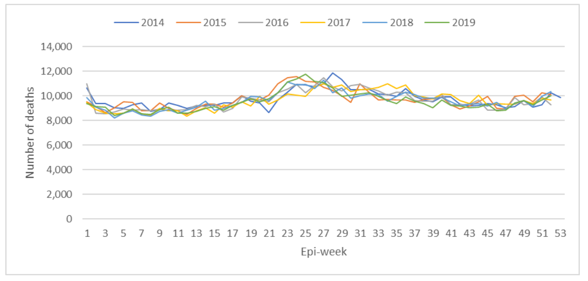

```{r, include = F}
knitr::opts_chunk$set(echo = F, message = F, warning = F)
setwd("~/Recon/jjayes_distill/_posts/2021-07-28-spanish-flu-mortality")
library(tidyverse)
library(tidymodels)
library(tidytext)
library(lubridate)
library(glue)
library(ggridges)

theme_set(theme_light())

df <- read_rds("data/spanish_flu_data.rds")

```


# The 1918 Spanish flu pandemic in South Africa: assesing mortality

## Abstract

*This paper examines mortality during the Spanish flu pandemic of 1918 in 15 districts in the Cape Province of South Africa. I make use of 40,000 digitized Forms of Notice of a Death produced in the Cape districts between 1915 and 1920. I use three methods to assess excess mortality across the districts, and assess the extent to which measures of pre-existing health and social status which are correlated with mortality from the flu. I use a linear support vector machine to collapse the recorded ethnicity of individuals to a three-class race grouping. I find after assessing excess mortality that it is unlikely there was significant under counting of the number of deaths during the Spanish flu pandemic due to misclassification of cause. Regarding the features correlated with pandemic mortality, I find that pre-existing levels of health in a district indicated by child mortality are strongly correlated with mortality rates during the pandemic. I find that district with high levels of mortality from pneumonia and influenza prior to the pandemic suffered severely from mortality during the pandemic. Finally, I find no support for the notion that socio-economic factors proxied by the literacy of a family member or foreign born status are correlated with pandemic mortality rates.*

## Introduction

The Spanish flu was one of the worst pre-cursors to the current Covid-19 pandemic, extracting a high death toll on working age populations the world over. The disease spread rapidly, and took a heavy toll on populations with poor pre-existing health conditions, and those who could not take measures to lessen the burden of the disease once infected. It is worth looking back into the past to find out how the pandemic engulfed the civil apparatus who recorded mortality from the flu at the time, as well as trying to identify features that existed in communities prior to the pandemic which were correlated with high mortality during the flu. This is what I attempt in the paper below. I cover some of the literature which guides my investigation, examine excess mortality during the pandemic, and identify features associated with high mortality across 15 districts in the Cape.

## Historical background and related literature

The Spanish flu reached South Africa in mid 1918. A first, less virulent strain spread through Natal and into the Witwatersrand in winter, before a more severe strain gripped the Cape in October of 1918 as soldiers returned from the First World War. Historian Howard Phillips argues that soldiers embarking on the Jaroslav and the Veronej from Freetown in Sierra Leone acquired the disease in port, and brought it with them on their homeward journey before transmitting it to their families and neighbours in the Cape [-@Phillips1984, p. 9]. The Cape was ravaged by the pandemic during "Black October" of 1918, and like populations across the world, working age adults suffered high mortality, threatening livelihoods in the midst of and in the aftermath of the pandemic [@Arthi2021]. @Fourie2021 have shown that more than half of those who died during the pandemic in a sample of districts in the Cape were between 18 and 50 years of age, evidencing a "w-shaped" mortality curve, in contrast to the more common "u-shaped" curve. @Taubenberger2006 show that this pattern held across the world during the 1918 pandemic, with more than half of those recorded dead between 20 and 40 years of age.
 
In explaining the severity of the disease, @Arthi2021 note that the novelty of the virus "contributed to its destruction", detailing the time that it takes for a community to detect the disease, appreciate its epidemiology, create medicines and reach immunity which allowed the flu to rapidly spread and harm populations across the world [-@Arthi2021, p. 13]. 

There is strong evidence of an immunizing effect that the less severe Natal strain provided in South Africa, though this was not known at the time. @Phillips1984 cites the Influenza Epidemic Commission of 1919 in South Africa suggest that different strains of organisms caused the two waves of the pandemic in the country, but that regarding the immunizing effect, "no definite pronouncement is possible on this subject" [-@Phillips1984, p. 293]. However, modern research has shown that cross-protection certainly lessened the impact of the flu among those exposed to the earlier, milder variant. @Shanks2010 compare mortality rates among diamond miners in Kimberley and gold miners on the Rand during Black October. They find a mortality rate 35 times higher among Kimberley's diamond miners than Rand gold miners which the authors attribute to the formers' lack of exposure to the less lethal strain earlier in the year. The authors control for the characteristics of the miners in their comparison, including recruitment, working conditions, housing and medical care [@Shanks2010, p. 2]. 

Similarly, in Canada @Bogaert2015 studies protection from initial exposure to the less virulent strain among soldiers in the Canadian Expeditionary Force and finds that soldiers who were exposed to pneumonia and influenza prior to the second wave saw 82 percent protection from severe illness and 84 percent protection from death compared to compatriots who were later recruited from rural farming districts and had supposedly not been exposed to the first strain [-@Bogaert2015, p. 34]. This finding is replicated among military camps in the United States at the time. @Barry2008 find that as early as March 1918, a mild strain of the virus was circulating in military camps and provided naturally acquired immunity to the more virulent strain that followed in the fourth quarter of the year. 

There is discussion by @Shanks2016 regarding whether the two waves studied in soldiers in Canada, the United States, Australia and South Africa were caused by different viruses or different strains of the same virus, while @Bogaert2016 argues the distinction does not take away from the crucial point, initial exposure provided protection from the virulent wave in the second half of 1918. 

The severity of the October wave may explain why South Africa was spared the third wave of early 1919 detailed by @Taubenberger2006 and the fourth wave that spread in Asia in mid 1919 noted by @Lin2014 and @Ogasawara2018 in their analysis of the long-run effects of *in utero* exposure (in Taiwan and China respectively). @Phillips1984 argues that although the epidemic's presence was lethal, "it was short-lived and by the middle of November it had virtually abated" [-@Phillips1984, p. 294]. 

A wealth of research has sought to examine what features explain the differing levels of mortality in disparate communities during the pandemic. @AcuaSoto2011InfluenzaAP examine features correlated with mortality from the flu in 66 large cities across the United States. The authors find that baseline health status was important, as proxied by pre-pandemic pneumonia, which they argue is "a bacterial condition with a strong biological interaction with the influenza virus" and infant mortality rates as a surrogate for population health [-@AcuaSoto2011InfluenzaAP, p. 13]. @Clay2018 study the effect of pollution from coal fired power plants on pandemic mortality in the United States, and find that poor air quality was "an important cause of mortality during the pandemic" [-@Clay2018, p. 79]. The authors find that pollution was a significant contributor to deaths during the pandemic. They find that the magnitude of the effect was approximately half of the effects of pre-existing levels of health in a community. A recent study on fog events in London corroborates the interaction between pollution and mortality from respiratory diseases [@Hanlon2018LondonFA]. @Arthi2021 in their meta-analysis, as well as @Chowell2008 who study the flu in England and Wales, and @Mamelund2006 who examines the flu in Denmark all find that socio-economic status impact health outcomes. They collectively find that those who live in high density housing, for example the poor in cities, had poorer pre-existing health as measured by cases of and deaths from pneumonia and influenza, and high mortally rates during the pandemic. @Clay2018 posit that further socio-economic indicators such as foreign born status and illiteracy may have precluded residents from implementing public health guidelines. @Grantz2016 examine the differential mortality from the pandemic across Chicago and find that higher rates of illiteracy correlated with higher rates of mortality across districts. Importantly, these socio-demographic effects evidenced spillovers, as literate and native born residents in districts with high shares of effects of illiteracy and foreign born residents saw a higher mortality than compatriots with similar observable characteristics [@Arthi2021].

## Data

The sources of data available to a researcher without doubt shape the design of their study. In his authoritative account of the Spanish flu pandemic in South Africa, historian Howard Phillips notes that prior to his own study, “extensive documentation... from [unpublished evidence] in the report of the Government-appointed Commission of Inquiry" had laid on the shelves of the Library of Parliament unexamined [-@Phillips1984, p.9]. His analysis of this information told the story of the pandemic in a way that had not been told before. Similarly, the digitization of death records allows different kinds of questions about the pandemic of 1918. Specifically it opens up an assessment of excess mortality and an indication of the importance of pre-existing levels of health in determining pandemic mortality rates within the districts of the Cape.

The dataset analysed here is made up of 40,000 digitized Forms of Information of a Death of individuals in 15 districts of the Cape Province between 1915 and 1920. The Forms are recorded as of Act No. 7 of 1894 of the Cape Colony. They contain demographic information about the deceased, details about their death, and details about the informant who told the Registrar about their passing. Most often the informant was a family member, as recorded on the Forms. In this study, the date of death, cause of death and demographics are of particular interest. The years prior to the pandemic serve as a baseline against which to compare excess mortality during the pandemic. There are some limitations regarding the recording of cause of death and duration of last illness. These are discussed in detail in @Fourie2021. In short, where a doctor has tended to the deceased and completed a certificate, the Form will include the pertinent information from the Medical Practitioners certificate. In the absence of such a certificate, the Informant can provide this information if known. The text on the Form reads:

<blockquote>

N.B. -- If the certificate of a Medical Practitioner is produced, the causes of Death and Duration of Illness must be recorded in the Registration Book by the Deputy Registrar and Assistant to the Deputy Registrar as stated in such Certificate, which is to be attached to the form.

Source: @Civil1918
</blockquote>

<aside>

```{r}
library(ggridges)

# jpeg(
#     filename="images/duration_of_last_illness_grey.jpeg",
#     width=8,
#     height=6,
#     units="in",
#     res=1000)

df %>%
  filter(sf_indicator == 1) %>%
  ggplot(aes(x = doli_days, y = town, fill = town)) +
  geom_density_ridges() +
  geom_vline(xintercept = 3, lty = 2) +
  scale_fill_grey() +
  scale_x_continuous(limits = c(NA, 50)) +
    theme(legend.position = "none") +
    labs(x = "Duration of illness in days",
         y = NULL)

# dev.off()

# df %>%
#   filter(sf_indicator == 1,
#          !is.na(doli_days),
#          between(doli_days, 0, 100)) %>% 
#     summarise(mean(doli_days))
```


```{r}
library(gtsummary)
library(gt)

table <- df %>%
  select(town, sex, race, age_years, doli_days, sf_indicator, signed_yes_or_no) %>%
  mutate(signed_yes_or_no = str_to_lower(signed_yes_or_no)) %>%
  mutate(literate_proxy = case_when(
    str_detect(signed_yes_or_no, "maark|mark|merk|no|x") ~ "No",
    str_detect(signed_yes_or_no, "yes") ~ "Yes",
    TRUE ~ "No"
  ),
  literate_proxy = as.factor(literate_proxy)) %>% 
    select(!signed_yes_or_no) %>% 
    mutate(sf_indicator = ifelse(sf_indicator == 1, "Flu death", "Other death")) %>% 
  filter(race != "Unknown",
         !is.na(race),
         race != "NA",
         !is.na(sex),
         sex != "NA") %>%
    rename_with(., str_to_title) %>% 
    rename(`Age in years` = Age_years,
           `Duration of illness in days` = Doli_days,
           `Literacy proxy` = Literate_proxy) %>% 
    relocate(`Literacy proxy`, .after = Race) %>% 
  tbl_summary(by = Sf_indicator,
              missing_text = "Missing",
              type = `Literacy proxy` ~ "categorical") %>% 
    add_overall() %>% 
    bold_labels() %>% 
    modify_header(label = "**Variable**")

table

# table %>% 
#       as_flex_table() %>%
#       flextable::save_as_docx(path = "tables/desc_stats.docx")
```


</aside>

### Classification of race from ethnicity

Race is one important feature of the analysis which follows. As noted in @Fourie2021, health and wealth in the Cape Province of 1918 were "closely correlated to race... with race being a strong predictor of income and social status" [-@Fourie2021, p. 2]. The Forms of Information of a Death provide a field for the race of the deceased to be recorded. However, often ethnicity of the deceased was recorded instead. See for example the record of Wills Bunu, who died in Queenstown on the 26th of October 1918 whose race is recorded as "Fingo". Fingo is a term for a group of ethnicities who fled Natal in the aftermath of the *Mfecane* to reside in the Xhosa speaking Eastern region of the Cape [@Stapleton, p. 362]. @Mtumane argues that the Fingo were "were embraced and integrated" by Xhosa in the Eastern Cape by the time of the Spanish flu [@Mtumane, p. 68]. In any event, some categorization has to be done to limit the number of different categories of recorded ethnicity.


Further, more than 200 ethnicities appear only once among the records, such that the distribution of observed ethnicities is skewed to the right, with 419 *different* ethnicities recorded, evident in Figure \@ref(fig:ethnicity-distribution). 

<aside>
```{r, ethnicity-distribution, fig.cap="Distribution of ethnicities recorded on Forms of Information of a Death"}

jpeg(
    filename="images_bloom/12_2.jpeg",
    width=6,
    height=6,
    units="in",
    res=1500)

df %>% 
  count(race_original, sort = T) %>% 
  ggplot(aes(n)) +
  geom_histogram(fill = "grey50") +
  scale_x_log10() +
  labs(x = "Number of observations of a recorded ethnicity (log scale)",
       y = "Number of ethnicities")

dev.off()
```
</aside>

To classify these 419 different categorical values down into a more manageable number; 3 broad race groupings in use in the Cape at the time and in South Africa today, I use a combination of regular expression and a linear support vector machine learning algorithm.

To simplify the problem I hand coded the minority class (white) using regular expression (for example, coding "European" and "English" to white), and used a linear support vector machine to classify the remaining observations to black and coloured based on a hand-coded training set. @Suthaharan2016 explains that a linear support vector machine is well suited to binary classification using text data, as it can make use of many sub-word features in a computationally cheap manner. It performs best when the classes in the training set are balanced. Because white individuals make up a minority of the dataset, it is possible to simply hand-code their observations as white and then make use of the machine learning algorithm to classify the remaining roughly equal classes. The binary linear SVM works by dividing the data domain along a hyperplane "to separate classes in the original domain" [@Suthaharan2016, p. 2]. 

The advantage of the linear SVM as opposed to a more flexible machine learning method, for example a neural network, is that the linear SVM is explainable and it is possible to pull out indicators of how the algorithm performs the classification. In this case, I use the sub-word features of the ethnicities as predictors of race. As detailed in the appendix, I achieve an accuracy of 99.8 percent in the classification problem on previously unseen data. This model is a useful research output as the trained model can be employed by other researches faced with similar data and classification problems. Specifics are detailed in the appendix.

The output of the classification process is shown in Figure \@ref(fig:ethnicity-race-classification) in the appendix for the 12 most common classes for each race.

## How many died during the pandemic?

In quantifying the number of South Africans who died during the pandemic, there were clear challenges to the recording apparatus of the government at the time. @Phillips1984 notes that "even under normal conditions in 1918, the South African government lacked the means to record every death in the country" -- a feature which shows up in the infant and child mortality rates that vary widely between districts calculated from the death notices prior to the pandemic [@Phillips1984, p. 288]. Further, there are likely differences in the quality of records that vary with geography; @Phillips1984 notes that the legislation which stipulated the recording of deaths, the 1894 Births and Deaths Registration Act, "in theory applied to all inhabitants, but in practice was largely a dead letter in predominantly Black rural areas" [@Phillips1984, p. 288]. The text contained on the death notices evidence sensible differences in recording standards by geography, with the direction "If informants in municipalities and special urban areas do not appear personally before [District Registrar] proper Declaration must be completed and attached hereto. In *Rural* Areas Informants can report in *three* ways -- one being under declaration. Medical Certificates essential in Urban Areas" [@Civil1918]. Evidently, government officials at the time accounted for the difficulty in recording deaths in rural areas by lessening the requirements. Nonetheless, in comparing pre-pandemic figures with the information presented from the pandemic itself, we require not that under-reporting did not exist, but the less onerous assumption that the level of under-reporting remained constant within each district. 

Figure \@ref(fig:viridis-deaths) shows a heatmap of the frequency of deaths in each district. The pandemic period is striking. Further, we see lighter coloured areas in larger districts like Oudtshoorn and Queenstown which have higher mortality prior to the pandemic (owing to their larger populations and hence greater number of deaths) than small districts such as Elliot and Sea Point.

```{r viridis-deaths, layout="l-body-outset", fig.width = 8, fig.height=6, fig.cap="Heatmap of deaths per week"}

jpeg(
    filename="images_bloom/12_4.jpeg",
    width=6,
    height=6,
    units="in",
    res=1500)

df %>%
  filter(between(death_date, ymd("1915-01-01"), ymd("1920-12-30"))) %>%
  mutate(death_date = floor_date(death_date, unit = "week")) %>%
  count(death_date, town) %>%
  pivot_wider(names_from = "town", values_from = "n", values_fill = 0) %>%
  pivot_longer(-death_date, names_to = "town", values_to = "n") %>%
  mutate(town = fct_reorder(town, n)) %>%
  ggplot(aes(death_date, town, fill = n)) +
  geom_tile() +
  scale_fill_gradient2(low = "grey90",
                       high = "grey20",
                       mid = "grey90",
                       midpoint = 1,
                       trans = "sqrt") +
  labs(
    x = NULL,
    y = NULL,
    fill = "Number of deaths per week"
  ) +
  theme(legend.position = "bottom") +
  guides(fill = guide_colourbar(
    barwidth = 30, barheight = .5,
    title.position = "top",
    title.hjust = .5
  ))

dev.off()
```

There is considerable variation in the crude death rate by district during the pandemic, as shown in Figure \@ref(fig:town-density). Here we can see two important features of the pandemic in our sample of Cape districts. First, the pandemic arrived in different districts at different times. In districts close to Cape Town and along the train line to Kimberley, where the soldiers arrived soon after they were released from quarantine at port, the virus spread rapidly. The evidence in this paper corroborate that of @Phillips1984 regarding the swift abatement of the virus following the peak in October. Only in Oudtshoorn and Komga do the effects of the flu appear to have lingered, with elevated mortality rates into December of 1918. Second, the rate of death, and likely the spread of the disease, differed between districts. For example, the steep surge of cases in Queenstown contrasts with a sustained deadly spread in Oudtshoorn.

<aside>
Crude death rate is the total number of deaths during a given time interval divided by the population.
</aside>

```{r town-density, layout="l-body-outset", fig.width = 8, fig.height=6, fig.cap="Ridge plot of number of deaths in district by date"}

jpeg(
    filename="images_bloom/12_5.jpeg",
    width=6,
    height=6,
    units="in",
    res=1500)

df %>%
  filter(between(death_date, ymd("1918-09-01"), ymd("1918-12-30"))) %>%
  mutate(death_date = floor_date(death_date, unit = "days")) %>%
  count(death_date, town) %>%
  pivot_wider(names_from = "town", values_from = "n", values_fill = 0) %>%
  pivot_longer(-death_date, names_to = "town", values_to = "n") %>%
  inner_join(df %>%
    filter(between(death_date, ymd("1918-09-01"), ymd("1919-08-30"))) %>%
    mutate(death_date = floor_date(death_date, unit = "3 days")) %>%
    count(death_date, town) %>%
    group_by(town) %>%
    slice_max(n, n = 1) %>%
    ungroup() %>%
    arrange(death_date) %>%
    select(town) %>%
    mutate(row_num = row_number())) %>%
  mutate(town = fct_reorder(town, row_num, .desc = T)) %>%
  ggplot(aes(x = death_date, y = town, height = n, fill = town, group = town)) +
  geom_density_ridges(
    stat = "identity", show.legend = F,
    alpha = .8
  ) +
    scale_fill_grey() +
  # scale_fill_manual(values = wesanderson::wes_palette("Zissou1", 15, type = "continuous")) +
  labs(
    x = "Date of death",
    y = NULL
  )

dev.off()
```


### What were the mortality rates in each district during the pandemic?

#### Candidate methods for assessing (excess) mortality.

A question that poses some difficulties to answer is how many South Africans died during the pandemic, and how many died specifically of the flu.

A great benefit of the dataset at hand is the recording of a cause of death on the notice. This was either copied from the Certificate of the Medical Practitioner, or in the absence of such a certificate, told to the registrar by the informant. Hence, the most intuitive method to assess how many people died in each district of the Spanish flu is simply to count the number of deaths recorded with "Spanish flu" listed in the cause of death column. However, there are a number of drawbacks to this method.

- Doctors and families who reported to the registrar the cause of death may not have known that the deaths at the beginning of the pandemic were due to the Spanish flu as news of the disease likely travelled across the country slower than the disease itself, as explained by @Arthi2021.
- There is likely some selection into the provision of a cause of death by location within a district. As noted in the data explanation, deaths in rural areas were not required to have a certificate of a medical practitioner who would have investigated the death and recorded its cause.
- There are discrepancies in the reporting of the disease by district. Contrast for instance the labelling of deaths in Cradock and Paarl. In the top facet of Figure \@ref(fig:cradock-paarl-causes), it is evident that the vast majority of deaths during the pandemic are labelled as Spanish flu deaths. In contrast, fewer than half of the deaths that occurred during the pandemic are labelled as Spanish flu deaths in Paarl.
- To avoid this complication it is tempting to simply count the number of deaths in each district during the pandemic period and conclude that these were caused by the flu. However, districts of different population sizes would have expected different numbers of deaths in the absence of the pandemic. Hence it is not advisable to conclude that all recorded deaths were due to the flu.

```{r cradock-paarl-causes, layout="l-body-outset", fig.width = 8, fig.height=6, fig.cap="Density plot comparing causes of death during the pandemic in Cradock and Paarl"}

jpeg(
    filename="images_bloom/12_6.jpeg",
    width=6,
    height=6,
    units="in",
    res=1500)

df %>%
  filter(between(death_date, ymd("1918-09-01"), ymd("1919-01-01")),
         town %in% c("Cradock", "Paarl")) %>%
  mutate(death_date = floor_date(death_date, unit = "week"),
         causes_of_death = str_to_lower(causes_of_death)) %>%
  mutate(spanish = str_detect(causes_of_death, "spanish"),
         spanish = ifelse(spanish == TRUE, "Cause of death labelled 'Spanish flu'", "Other cause of death")) %>%
    count(death_date, spanish, town) %>%
    pivot_wider(names_from = "spanish", values_from = "n", values_fill = 0) %>% 
    pivot_longer(-c(death_date, town)) %>% 
    filter(name != "NA") %>% 
    ggplot(aes(death_date, value, fill = name)) +
    geom_area() + 
    scale_fill_grey(start = .5, end = .9) +
    # scale_fill_manual(values = wesanderson::wes_palette("Zissou1", 2, type = "continuous"),
                      # guide = guide_legend(reverse = T)) +
    facet_wrap(~ town, nrow = 2) +
  theme(legend.position = "bottom") +
  labs(x = NULL, 
       y = "Number of deaths per week",
       fill = NULL)

dev.off()
```

Table \@ref(tab:cradock-paarl-causes-tab) evidences that the majority of deaths in Paarl during the pandemic were labelled simply as "Influenza".

```{r cradock-paarl-causes-tab, layout="l-body-outset"}
cradock_paarl_tab <- df %>%
  filter(
    between(death_date, ymd("1918-09-01"), ymd("1919-01-01")),
    town %in% c("Cradock", "Paarl")
  ) %>%
  count(causes_of_death, town, sort = T) %>%
  group_by(town) %>%
  slice_max(n, n = 12, with_ties = F) %>%
  ungroup() %>%
  select(Cradock = causes_of_death, n_cradock = n) %>%
  head(12) %>%
  bind_cols(df %>%
    filter(
      between(death_date, ymd("1918-09-01"), ymd("1919-01-01")),
      town %in% c("Cradock", "Paarl")
    ) %>%
    count(causes_of_death, town, sort = T) %>%
    group_by(town) %>%
    slice_max(n, n = 12) %>%
    ungroup() %>%
    select(Paarl = causes_of_death, n_paarl = n) %>%
    tail(12))

cradock_paarl_tab %>% 
    knitr::kable(caption = "Comparison of common causes of death in Cradock and Paarl during the pandemic")

# cradock_paarl_tab %>% 
#     flextable() %>% 
#     save_as_docx(path = "tables/cradock_paarl_tabl.docx")
    
# table %>% 
#       as_flex_table() %>%
#       flextable::save_as_docx(path = "tables/desc_stats.docx")
```

An alternate set of methods for quantifying excess mortality use history as a guide for the number of deaths that we can expect to occur in each district. I use three methods wherein the mortality figures for three years preceding the pandemic are used as a guide, first looking at the average number of deaths in each district during the pandemic peak (October, November and December), second taking an average of the whole year mortality in each district, and third creating regression models with the historical data to predict the expected number of deaths in the pandemic period. I explain each below.

First, making use of the death notices from 1915 to 1917 and following the methodology laid out by the South Africa Medical Research Council (SAMRC) in @Dorrington2021, I calculate the average number of deaths per month in each town during the pandemic peak of October, November and December in the three preceding years as a baseline. The SAMRC define excess mortality is calculated as "the number of all-cause deaths in the last week less the number that might have been expected to have occurred" [@Dorrington2021, p. 2]. I widen the bandwidth from one week to one month due to the coarsity of the data at district level. The resulting smoother estimates have less noise and appear reasonable. I then subtract this expected number of deaths from the observed number during the pandemic to calculate excess mortality during the 3 months of pandemic peak in 1918. The advantage of this method is that it captures the seasonal variation in mortality, as shown in Figure \@ref(fig:seasonality). It is interesting to note that the the smoothed line shows a peak in mortality in the third quarter of the year in the Cape between 1915 and 1920. This is in contrast to the seasonal pattern in mortality in South Africa as a whole in since 2015 as shown by @Dorrington2021 which displays a dramatic peak during mid-winter shown in \@ref(fig:samrc-pattern).

<aside>

```{r, samrc-pattern, echo=FALSE, out.width='40%', fig.cap="Seasonal pattern in mortality in South Africa"}

```
Source: @Dorrington2021
</aside>

```{r seasonality, layout="l-body-outset", fig.width = 8, fig.height=6, fig.cap="Mortality by week across districts - excluding 1918"}
jpeg(
    filename="images_bloom/12_7.jpeg",
    width=6,
    height=6,
    units="in",
    res=1500)

df %>% 
    filter(sf_indicator ==1) %>% 
    mutate(death_date = floor_date(death_date, "week")) %>% 
    count(death_date) %>% 
    mutate(year = year(death_date),
           week = week(death_date)) %>%
    filter(year != 1918,
           year > 1914) %>% 
    ggplot(aes(week, n, colour = factor(year), group = year)) +
    geom_point() +
    geom_line() +
    geom_vline(xintercept = c(40, 44), lty = 2) +
    geom_smooth(aes(group = 1), colour = "grey10") +
    expand_limits(y = 0) +
    # scale_color_manual(values = wesanderson::wes_palette(5, name = "Zissou1", type = "continuous")) +
    scale_color_grey() +
    labs(x = "Week of the year",
         y = "Number of deaths per week",
         colour = NULL) +
  theme(legend.position = "bottom")

dev.off()
```

This first method results in estimates of excess mortality shown in Table \@ref(tab:samrc-method-tab). Here it is evident that while the largest number of deaths occurred in Queenstown and Paarl, the districts of Peddie and Elliot saw more than 10 times as many deaths as they had in the period between October and December in the three years preceding the pandemic.

```{r samrc-method-tab, layout="l-body-outset"}
df_samrc <- df %>%
  mutate(
    week = week(death_date),
    year = year(death_date)
  ) %>%
  filter(
    between(week, 40, 53),
    death_date < ymd("1918-01-01")
  ) %>%
  count(town, year) %>%
  group_by(town) %>%
  mutate(mean_deaths_1915_1917 = mean(n)) %>%
  ungroup() %>%
  distinct(town, mean_deaths_1915_1917) %>%
  inner_join(df %>%
    mutate(
      week = week(death_date),
      year = year(death_date)
    ) %>%
    filter(
      between(week, 40, 53),
      year == 1918
    ) %>%
    count(town, year) %>%
    rename(deaths_1918 = n), by = "town") %>%
  select(-year) %>%
  arrange(desc(deaths_1918)) %>%
  mutate(
    excess_mortality = deaths_1918 - mean_deaths_1915_1917,
    across(where(is.numeric), round),
    excess_mort_perc = scales::percent(excess_mortality / mean_deaths_1915_1917, accuracy = 1)
  )

df_samrc %>% 
  knitr::kable(
    col.names = c("District", "Pre-pandemic mean", "Pandemic period", "Excess mortality", "Percent excess mortality"),
    caption = "Excess mortality based on SAMRC method",
    align = c("l", rep('r', 4))
  )

# df_samrc %>% 
#     flextable() %>% 
#     save_as_docx(path = "tables/excess_mortality_samrc.docx")

```


Second, I follow the methodology of @AcuaSoto2011InfluenzaAP who define excess mortality as "deaths observed during the pandemic years minus the average death counts in the pre-pandemic years" [@AcuaSoto2011InfluenzaAP, p.23]. While these authors had access to seven years of data preceding the pandemic, I calculate a simple average of the number of deaths per year in each district in the three prior years and subtract the number of deaths in 1918. Table \@ref(tab:mean-mortality-by-district-tab) shows the mortality by district from 1915 to 1917, and the average across these three years.

```{r mean-mortality-by-district-tab, layout="l-body-outset"}
df_acuasoto <- df %>%
  filter(death_date < ymd("1918-01-01")) %>%
  mutate(year = year(death_date)) %>%
  count(town, year) %>%
  group_by(town) %>%
  mutate(average = mean(n)) %>%
  ungroup() %>%
  pivot_wider(names_from = "year", values_from = "n") %>%
  relocate(average, .after = `1917`) %>%
  mutate(across(-town, ~ round(., 0))) %>%
  inner_join(df %>%
    mutate(year = year(death_date)) %>%
    filter(year == 1918) %>%
    count(town) %>% rename(`1918` = n)) %>%
  mutate(
    excess_mortality = `1918` - average,
    excess_mort_perc = scales::percent(excess_mortality / average, accuracy = 1)
  ) %>%
    arrange(desc(excess_mortality))

df_acuasoto %>% 
  knitr::kable(
    caption = "Excess mortality based on Acuña-Soto, Viboud, and Chowell method",
    col.names = c("District", "1915", "1916", "1917", "'15-'17 Average", "1918", "Excess mortality", "Percent excess mortality"),
    align = c("l", rep("r", 7))
  )

# df_acuasoto %>% 
#     flextable() %>% 
#     save_as_docx(path = "tables/excess_mortality_asvc.docx")
```

Figure \@ref(fig:excess-mortality-method-2) shows the excess mortality based on method two. Here we can see that Peddie and Elliot stand out with large excess mortality relative to their mean mortality preceding the pandemic.

```{r excess-mortality-method-2, layout="l-body-outset", fig.width = 8, fig.height=6, fig.cap="Excess mortality based on methodology by @AcuaSoto2011InfluenzaAP"}
jpeg(
    filename="images_bloom/12_8.jpeg",
    width=6,
    height=6,
    units="in",
    res=1500)

df %>%
  mutate(year = year(death_date)) %>%
  count(year, town) %>%
  filter(year == 1918) %>%
  rename(deaths_1918 = n) %>%
  inner_join(
    df %>%
      mutate(year = year(death_date)) %>%
      count(year, town) %>%
      filter(year <= 1917) %>%
      group_by(town) %>%
      summarise(avg_deaths_1915_1917 = mean(n))
  ) %>%
  select(-year) %>%
  mutate(town = fct_reorder(town, deaths_1918)) %>%
  pivot_longer(-town, names_to = "type", values_to = "deaths") %>%
  mutate(type = case_when(
    str_detect(type, "deaths_1918") ~ "Mortality in 1918",
    TRUE ~ "Mean mortality between 1915 and 1917"
  )) %>%
  ggplot(aes(deaths, town)) +
  geom_line(aes(group = town)) +
  geom_point(aes(colour = type)) +
  scale_x_continuous(labels = scales::number_format()) +
  scale_colour_grey(start = .3, end = .7) +
  theme(legend.position = "bottom") +
  labs(
    colour = NULL,
    # caption = "Length of line represents absolute excess mortality",
    y = NULL,
    x = "Mortality"
  )

dev.off()
```

Third, I use regression models to extrapolate the mortality we would expect in each district if the historical trends from 1915 to 1917 continued.

I use three regression models. These are linear model with only an intercept - in effect the same as the averaging procedure from above. Specifically, I average the number of deaths in the year in the three years prior to 1918 as a guide for the average number of deaths per district.

Next, I use a simple linear regression. This accounts, for instance, for population growth and consequent linear increases in the number of registered deaths per district per year that we would expect with a larger population.

<aside>

The linear trend is shown in Figure \@ref(fig:linear-trend) here, alongside a line of equality: 

```{r, linear-trend, layout="l-body-outset", fig.width = 8, fig.height=6, fig.cap="Linear trend for predicted and excess mortality"}
library(ggrepel)

jpeg(
    filename="images_bloom/12_9.jpeg",
    width=6,
    height=6,
    units="in",
    res=3000)

df %>%
  mutate(year = year(death_date)) %>%
  count(year, town) %>%
  filter(year <= 1917) %>%
  nest(data = c(year, n)) %>%
  mutate(lm_fit = map(data, ~ lm(n ~ year, data = .x))) %>%
  inner_join(
    df %>%
      mutate(year = year(death_date)) %>%
      count(year, town) %>%
      filter(year > 1917) %>%
      nest(post_data = c(year, n))
  ) %>%
  mutate(augmented = map2(lm_fit, post_data, ~ augment(.x, newdata = .y))) %>%
  unnest(augmented) %>%
  filter(year == 1918) %>%
  ggplot(aes(.fitted, n, label = str_to_title(town))) +
  geom_point() +
  geom_abline(lty = 2) +
  geom_smooth(method = "lm", se = F, colour = "grey20") +
  geom_text_repel() +
  labs(
    x = "Predicted 1918 mortality based on linear trend",
    y = "Actual 1918 mortality",
    caption = "Note: dotted line is line of equality and solid line is line of best fit"
  ) 

dev.off()
```

Is appears that towns with higher predicted mortality in 1918 based on the linear trend have higher actual mortality in 1918. 

</aside>

Further I use a regression model from Serfling that accounts for the seasonality of respiratory diseases like flu and influenza. According to @Cowling2006, “Serfling’s method uses cyclic regression to model the weekly proportion of deaths from pneumonia and influenza and to define an epidemic threshold that is adjusted for seasonal effects." [-@Cowling2006, 4].

Figure \@ref(fig:regression-methods) shows the mean and predicted ranges of expected mortality based on the three methods, as well as the observed pandemic mortality. It is evident that the districts with larger populations also have a larger range in the mortality protections. Oudtshoorn has a wide range in the projected mortality, followed by Paarl and Queenstown.


```{r, regression-methods, layout="l-body-outset", fig.width = 8, fig.height=6, fig.cap="Excess mortality based on regression methods"}
df_reg <- df %>%
  mutate(date = lubridate::floor_date(death_date, "week")) %>%
  count(date, town) %>%
  filter(date <= ymd("1918-01-01")) %>%
    mutate(date = as.numeric(date)) %>% 
  nest(data = c(date, n)) %>%
  mutate(
    lm_fit = map(data, ~ lm(n ~ date, data = .x)),
    q_fit = map(data, ~ lm(n ~ poly(date, 2), data = .x))
  ) %>%
  inner_join(
    df %>%
      mutate(date = floor_date(death_date, "week")) %>%
      count(date, town) %>%
      filter(date >= ymd("1918-01-01")) %>%
            mutate(date = as.numeric(date)) %>% 
      nest(post_data = c(date, n))
  ) %>%
  mutate(
    augmented_lm = map2(lm_fit, post_data, ~ augment(.x, newdata = .y)),
    augmented_q = map2(q_fit, post_data, ~ augment(.x, newdata = .y))
  ) %>%
  unnest(augmented_lm, augmented_q) %>%
  filter(between(date, ymd("1918-01-01"), ymd("1918-12-31"))) %>%
  select(town, date, n, .fitted, .fitted1) %>%
  rename(
    linear_trend = .fitted,
    seasonal_trend = .fitted1,
    observed = n
  ) %>%
  group_by(town) %>%
  mutate(across(observed:seasonal_trend, .fns = sum)) %>%
  ungroup() %>%
  distinct(town, observed, linear_trend) %>%
  inner_join(df %>% 
    mutate(death_date = floor_date(death_date, "month")) %>% 
    count(death_date, town) %>% 
    filter(death_date < ymd("1918-09-01")) %>%
    group_by(town) %>% 
    summarise(mean_deaths = mean(n),
              n = n()) %>% 
    ungroup() %>%
    mutate(mean_deaths = 12 * mean_deaths)) %>%
  inner_join(df %>%
  filter(between(death_date, ymd("1915-10-01"), ymd("1915-12-31"))) %>%
  group_by(town) %>%
  count() %>%
  ungroup() %>%
  mutate(n_1915 = n*3) %>%
  select(-n) %>% 
  inner_join(df %>%
    filter(between(death_date, ymd("1916-10-01"), ymd("1916-12-31"))) %>%
    group_by(town) %>%
    count() %>%
    ungroup() %>%
    mutate(n_1916 = n*3) %>% 
    select(-n)) %>%
  inner_join(df %>%
    filter(between(death_date, ymd("1917-10-01"), ymd("1917-12-31"))) %>%
    group_by(town) %>%
    count() %>%
    ungroup() %>%
    mutate(n_1917 = n*3) %>% 
    select(-n)) %>%
  pivot_longer(-town) %>%
  group_by(town) %>%
  mutate(across(value, .fns = mean)) %>%
  ungroup() %>%
  distinct(town, value) %>%
  rename(mean_deaths_oct_dec = value)) %>% 
  mutate(town = fct_reorder(town, observed)) %>% 
  pivot_longer(-c(town, observed), names_to = "type", values_to = "n") %>% 
  mutate(type = case_when(
    str_detect(type, "linear") ~ "Linear trend in deaths per month",
    str_detect(type, "mean_deaths_oct_dec") ~ "Average number of deaths per month (Oct-Dec)",
    TRUE ~ "Average number of deaths per month"
  )) %>% 
  group_by(town) %>% 
  mutate(mean_projected_deaths = mean(n)) %>% 
  ungroup()

jpeg(
    filename="images_bloom/12_10.jpeg",
    width=6,
    height=6,
    units="in",
    res=3000)

df_reg %>% 
  ggplot(aes(n, town)) +
  geom_line(aes(group = town, colour = "Estimate range from regression models")) +
  geom_point(aes(observed, town, shape = "Observed pandemic mortality")) +
  geom_point(aes(mean_projected_deaths, town, shape = "Mean projected mortality")) +
  scale_color_manual(values = "grey50") +
  guides(color = guide_legend(order = 2),
         shape = guide_legend(order = 1)) +
  labs(
    x = "Mortality",
    colour = NULL,
    shape = NULL,
    y = NULL
  ) +
  theme(legend.position = "bottom") +
    guides(shape = guide_legend(nrow=2))

dev.off()
```

In Table \@ref(tab:regression-tab-range) I show the excess mortality based on these regression methods. The estimates of excess mortality are similar to the estimates produced following the Acua-Soto methodology. The excess mortality percentages are lower than that calculated by following the SAMRC methodology due to a lower smaller detonator in calculating the latter, just the three months of the pandemic peak.

```{r, regression-tab-range, layout="l-body-outset"}
regression_based_excess_mort <- df_reg %>% 
  distinct(town, mean_projected_deaths, observed) %>% 
  mutate(excess_mortality = observed - mean_projected_deaths,
         across(where(is.numeric), .fns = round),
         excess_mortality_pct = scales::percent(excess_mortality / mean_projected_deaths, accuracy = 1)) %>% 
  arrange(desc(excess_mortality))
  # mutate(across(where(is.numeric), .fns = ~ scales::number_format(.x, accuracy = 1))) %>%
  

regression_based_excess_mort %>%
  knitr::kable(
    col.names = c("District", "Projected", "Observed", "Excess", " Percentage excess"),
    caption = "Excess mortality based on regression methods",
    align = c("l", rep("r", 4))
  )

# regression_based_excess_mort %>% 
#     flextable() %>% 
#     save_as_docx(path = "tables/excess_mortality_regression.docx")
```

Table \@ref(tab:excess-mort-comparison-tab) shows the differences in the number and percentage estimates of excess mortality produced following the three methods detailed above. The estimates differ between the methods, and there is not a clear relationship amongst the different methods as to which produces the largest across all the districts.

```{r, excess-mort-comparison-tab, layout="l-body-outset"}
df_excess_mort_comp <- df_samrc %>%
  select(town,
    excess_mortality_samrc = excess_mortality,
    excess_mort_perc_samrc = excess_mort_perc
  ) %>%
  inner_join(df_acuasoto %>%
    select(town,
      excess_mortality_acuasoto = excess_mortality,
      excess_mort_perc_acuasoto = excess_mort_perc
    ), by = "town") %>%
  inner_join(df_reg %>%
    mutate(
      excess_mortality = round(observed - mean_projected_deaths, 0),
      excess_mort_perc = scales::percent(excess_mortality / mean_projected_deaths)
    ) %>%
    mutate(
      excess_mortality_regression = excess_mortality,
      excess_mort_perc_regression = excess_mort_perc
    ) %>%
    select(town, excess_mortality_regression, excess_mort_perc_regression) %>%
    distinct(), by = "town") %>% 
  arrange(desc(excess_mortality_acuasoto))

df_excess_mort_comp %>% 
    knitr::kable(col.names = c("District", "SAMRC", "SAMRC", "Acua-Soto", "Acua-Soto", "Regression", "Regression"),
               caption = "Comparison of excess mortality estimates",
               align = c("l", rep("r", 6)))
```


```{r}
library(ggbump)

custom_palette <- c(RColorBrewer::brewer.pal(9, "Set1"),
                    RColorBrewer::brewer.pal(6, "Dark2")) %>% 
  sample(n_distinct(df_bump$town))

df_bump <- df_excess_mort_comp %>% 
    mutate(across(contains("perc"), ~ parse_number(str_remove(., " ")))) %>% 
    select(town, contains("perc")) %>% 
    pivot_longer(-town) %>% 
    group_by(name) %>% 
    arrange(desc(value)) %>% 
    mutate(y = row_number()) %>% 
    ungroup() %>% 
    mutate(name = factor(name),
           x = as.numeric(name))

jpeg(
    filename="images_bloom/12_11.jpeg",
    width=8,
    height=8,
    units="in",
    res=1500)


df_bump %>%
  ggplot(aes(x, y, colour = town)) +
  geom_point(size = 8) +
  geom_bump(cex = 2) +
  scale_colour_grey() +
  scale_y_reverse(breaks = df_bump$y %>% unique()) +
  scale_x_continuous(
    breaks = df_bump$x %>% unique(),
    labels = c(
      "Excess mortality\nSAMRC method",
      "Excess mortality\nRegression method",
      "Excess mortality\nAcuña-Soto, Viboud, \nand Chowell method"
    ),
    limits = c(NA, 3.2)
  ) +
  geom_point(
    data = tibble(x = 0.9, y = 1:15), aes(x = x, y = y),
    inherit.aes = F,
    color = "grey20",
    size = 10,
    pch = 21
  ) +
  geom_text(
    data = tibble(x = .9, y = 1:15), aes(x = x, y = y, label = y),
    inherit.aes = F,
    color = "grey20"
  ) +
  geom_text(
    data = df_bump %>%
      filter(name == "excess_mort_perc_acuasoto"),
    aes(label = town, x = x + .1),
    color = "grey20",
    nudge_y = .43,
    nudge_x = -.05,
    size = 3.5,
    fontface = 2,
    hjust = 0
  ) +
  theme(
    legend.position = "none",
    panel.grid = element_blank(),
    axis.text.y = element_blank(),
    axis.ticks = element_blank(),
    panel.border = element_blank(),
    axis.text.x = element_text(size = 12)
  ) +
  labs(
    y = "Excess mortality percentages ranked",
    x = NULL
  )

dev.off()
```


In an effort to contextualize these estimates, I compare the excess mortality figures in each town with the number of deaths recorded as caused by respiratory diseases^[The specific terms are detailed in the appendix], as well as figures from the Pandemic Commission of Inquiry referenced by @Phillips1984.

```{r, phillips-comparison-fig, layout="l-body-outset", fig.width = 8, fig.height=6, fig.cap="Comparison of excess mortality estimates, respiratory deaths and government estimates"}
phillips <- read_rds("data/phillips-comparison-august.rds") %>% 
  janitor::clean_names() %>% 
  mutate(stat = case_when(
    str_detect(stat, "Deaths from Death Notices") ~ "Respiratory deaths during pandemic",
    TRUE ~ "Estimates cited in Phillips"
  ))

jpeg(
    filename="images_bloom/12_13.jpeg",
    width=6,
    height=6,
    units="in",
    res=3000)

df_excess_mort_comp %>%
  select(!contains("perc")) %>%
  pivot_longer(-town) %>%
  group_by(town) %>%
  mutate(value = mean(value)) %>%
  ungroup() %>%
  select(town, value) %>%
  distinct() %>%
  mutate(stat = "Mean estimated excess mortality") %>%
  bind_rows(phillips) %>%
  mutate(town = fct_reorder(town, value)) %>%
  filter(town != "Sea Point") %>%
  mutate(stat = fct_relevel(stat, "Estimates cited in Phillips")) %>% 
  ggplot(aes(value, town, fill = stat)) +
  theme(legend.position = "bottom") +
  geom_col(position = "dodge") +
    scale_fill_grey(start = .1, end = .8) +
  # scale_fill_manual(values = wesanderson::wes_palette(3, name = "Zissou1", type = "continuous")) +
  labs(fill = NULL,
       y = NULL,
       x = "Number of deaths") +
  guides(fill = guide_legend(nrow = 2))

dev.off()
```

Here we observe that in the districts with larger populations, the estimates cited in @Phillips1984 are greater than both the number of respiratory deaths, and the mean excess mortality calculated with the three methods detailed above. In contrast, in the smaller districts, from Fryburg to Riversdale, the number of deaths from respiratory illness recorded during the pandemic are greater than the estimates cited in @Phillips1984. This is potentially indicative of under counting on the part of the Commission of Inquiry in the smaller districts. 

In all districts, my estimated excess mortality values are lower than the other two estimates. This means that we need not be concerned about under counting of pandemic deaths, if they are not recorded as such. We would be concerned about this if the excess mortality exceeded the estimates of Spanish flu deaths. In the remainder of the paper I calculate mortality and mortality rates based on respiratory deaths during the pandemic.

## District features correlated with pandemic mortality rates

### Pre-existing health

A wealth of literature has shown that there is a strong correlation between the level of health and prevalence of illnesses in different communities and their outcomes facing a pandemic.

I examine two measures of pre-existing health in the 15 districts which constitute the sample. The first uses infant and child mortality statistics as a proxy for the level of existing health and healthcare in a district. The second assess mortality from influenza and pneumonia prior to the pandemic to gauge levels of health in different communities. 

#### Pre-pandemic infant and child mortality rates

I begin with a proxy for pre-existing health in a district by calculating the infant mortality rate prior to the pandemic. I make use of the recorded infant deaths between January 1915 and December 1917, divided by the population of infants in each district as recorded in the Statistics of Population, Vital and Health Statistics of 1916 [@OfficeofCensusandStatisticsPretoria1918]. I extrapolate the full population of infants each year by multiplying the 1916 figure by three. This snapshot of the infants born in 1916 could be critiqued as unrepresentative of birth in the two surrounding years, yet it is the best data available.

Table \@ref(tab:births-tab) shows the number of births in 1916 in each district, by race, multiplied by 3. Figure \@ref(fig:infant-mortality) shows these figures with a confidence interval around them. It is clear that there is heterogeneity in infant mortality by race and district, such that this may be correlated with pandemic mortality rates. While the infant mortality rates may appear very high, it is possible that there is under-reporting in the number of births by district, while the death of a child is so tragic that it is recorded at a higher rate than the birth of a child. It is not prescient to conclude on these anomalies without additional sources of data.

```{r, births-tab, layout="l-body-outset"}
births_by_town <- read_rds("data/births_by_town.rds")

df_infant <- births_by_town %>%
  select(-total) %>%
  pivot_longer(-town, names_to = "race", values_to = "births") %>%
  mutate(race = str_to_title(race)) %>% 
  mutate(births = ifelse(births == 0, 1, births)) %>% 
  # for the three years
  mutate(births = 3*births) %>% 
  inner_join(df %>%
    filter(
      death_date < ymd("1918-01-01"),
      age_years <= 1,
      race != "NA"
    ) %>%
    count(town, race) %>%
    rename(deaths = n), by = c("town", "race")) %>% 
  mutate(infant_mort_rate = deaths/births,
         low = qbeta(.025, deaths + .5, births - deaths + .5),
         high = qbeta(.975, deaths + .5, births - deaths + .5)) %>% 
  filter(births > 5)

df_infant %>% 
  group_by(town) %>% 
  mutate(births_grouped = sum(births, na.rm = T),
         deaths_grouped = sum(deaths, na.rm = T)) %>% 
  ungroup() %>% 
  mutate(infant_mort_rate_grouped = deaths_grouped / births_grouped) %>%
  select(town, race, infant_mort_rate, infant_mort_rate_grouped) %>% 
  pivot_wider(names_from = "race", values_from = "infant_mort_rate") %>% 
  mutate(across(where(is.numeric), .fns = ~ .x*1000),
         across(where(is.numeric), .fns = round)) %>%
  arrange(desc(infant_mort_rate_grouped)) %>% 
  knitr::kable(col.names = c("District", "Aggregate", "White", "Black", "Coloured"),
               caption = "Infant mortality by race")
```


```{r, infant-mortality, layout="l-body-outset", fig.width = 8, fig.height=6, fig.cap="Infant mortality per 1000 children"}

jpeg(
    filename="images_bloom/12_13.jpeg",
    width=6,
    height=6,
    units="in",
    res=3000)

df_infant %>% 
  mutate(town = reorder_within(town, infant_mort_rate, race)) %>% 
  ggplot(aes(infant_mort_rate, town, colour = race, shape = race)) +
  geom_point() +
  geom_errorbarh(aes(xmin = low, xmax = high)) +
  scale_y_reordered() +
  scale_x_continuous(labels = number_format(scale = 1000)) +
    scale_colour_grey(start = .3, end = .7) +
  # scale_color_manual(values = wesanderson::wes_palette(3, name = "Zissou1", type = "continuous")) +
  theme(legend.position = "none") +
  facet_wrap(~ race, nrow = 3, scales = "free_y") +
  labs(x = "Infant mortality per 1000 recorded births",
       y = NULL)

dev.off()
```

Figure \@ref(fig:infant-mort-scatter) shows the relationship between infant mortality rates (detailed above) and pandemic mortality rates, calculated by dividing the number of respiratory deaths from the Forms by the population of individuals by race in each district from the 1911 census (in the case of black and coloured individuals) and the 1918 census (in the case of white individuals, conducted just prior to the pandemic). The aggregation of black and coloured mortality rates is a function of the denominator (population) reported in the census in aggregate.

Figure \@ref(fig:infant-mort-scatter) evidences a strong linear correlation between infant mortality rates and pandemic mortality rates across districts for black and coloured individuals, and across groups. The slope of the linear fit is less among white residents of the 14 districts^[Sea Point lacks a denominator as it was not recorded separately from Cape Town].

```{r, infant-mort-scatter, layout="l-body-outset", fig.width = 8, fig.height=6, fig.cap="Scatterplot and linear fit of infant and pandemic mortality by district"}
infant_mortality <- read_rds("data/infant_mortality.rds")

values <- hcl_palettes("sequential (single-hue)", n = 3, palette = "Grays", plot = TRUE)

values <- sequential_hcl(3, palette = "Grays")

jpeg(
    filename="images_bloom/12_14.jpeg",
    width=6,
    height=6,
    units="in",
    res=3000)

infant_mortality %>%
  filter(births > 5) %>%
  ggplot(aes(infant_mort_rate, mort_rate)) +
  geom_point(aes(size = total*1.2), colour = "black") +
  geom_point(aes(size = total, colour = race)) +
  # geom_smooth(method = "lm", se = F, aes(colour = "Both groups")) +
  geom_smooth(aes(colour = race, lty = race), method = "lm", se = F) +
  scale_x_continuous(labels = number_format(scale = 1000)) +
  scale_y_continuous(labels = number_format(scale = 1000)) +
    scale_color_grey(start = .2, end = .8) +
  # scale_color_manual(values = values) +
  # scale_color_manual(values = wesanderson::wes_palette(3, name = "Zissou1", type = "continuous")) +
  labs(
    x = "Infant mortality rate",
    y = "Pandemic mortality rate",
    size = "District population",
    colour = "Race group",
    lty = "Race group"
  ) +
  theme(legend.position = "bottom") +
  guides(
    colour = guide_legend(nrow = 3),
    size = guide_legend(nrow = 3)
  )

dev.off()


lm_1 <- infant_mortality %>%
  filter(race == "Both groups") %>% 
  lm(mort_rate ~ infant_mort_rate, data = .)

lm_2 <- infant_mortality %>%
  filter(race != "Both groups") %>% 
  lm(mort_rate ~ infant_mort_rate + race, data = .)

# stargazer::stargazer(lm_1, lm_2,
#   type = "text",
#   title = "Infant and pandemic mortality",
#   dep.var.caption = " ",
#   dep.var.labels = "Pandemic mortality rate",
#   covariate.labels = c("Infant mortality rate", "White"),
#   out="regs/infant-mort-scatter.txt"
# )

t1 <- tbl_regression(lm_1,
  label = list(infant_mort_rate = "Infant mortality rate",
               `(Intercept)` = "Constant"),
  intercept = T
) %>%
  # add_n() %>%
  add_significance_stars(thresholds = c(0.01, 0.05, .1))


t2 <- tbl_regression(lm_2,
  label = list(
    race = "Race",
    infant_mort_rate = "Infant mortality rate", 
    raceWhite = "White",
    `(Intercept)` = "Constant"
  ),
  intercept = T
) %>%
  # add_n() %>%
  add_significance_stars(thresholds = c(0.01, 0.05, .1))


tbl_merge_ex1 <- tbl_merge(
    tbls = list(t1, t2),
    tab_spanner = c("**(1)**", "**(2)**")
  ) %>% 
    bold_labels() %>% 
      modify_header(label = "**Variable**") %>%
      as_flex_table() %>% 
      footnote(i = 2, j = c(4, 7), value = as_paragraph("Heteroskedastic SE's from Sandwich package"),
               ref_symbols = c("a"),
               part = "header")

# tbl_merge_ex1 %>%
#     save_as_docx(path = "tables/reg_1.docx")
```

<table style="text-align:center"><caption><strong>Infant and pandemic mortality</strong></caption>
<tr><td colspan="3" style="border-bottom: 1px solid black"></td></tr><tr><td style="text-align:left"></td><td colspan="2"></td></tr>
<tr><td></td><td colspan="2" style="border-bottom: 1px solid black"></td></tr>
<tr><td style="text-align:left"></td><td colspan="2">Pandemic mortality rate</td></tr>
<tr><td style="text-align:left"></td><td>(1)</td><td>(2)</td></tr>
<tr><td colspan="3" style="border-bottom: 1px solid black"></td></tr><tr><td style="text-align:left">Infant mortality rate</td><td>0.139<sup>\*\*</sup></td><td>0.015</td></tr>
<tr><td style="text-align:left"></td><td>(0.046)</td><td>(0.012)</td></tr>
<tr><td style="text-align:left"></td><td></td><td></td></tr>
<tr><td style="text-align:left">White</td><td></td><td>-0.028<sup>\*\*\*</sup></td></tr>
<tr><td style="text-align:left"></td><td></td><td>(0.006)</td></tr>
<tr><td style="text-align:left"></td><td></td><td></td></tr>
<tr><td style="text-align:left">Constant</td><td>0.003</td><td>0.038<sup>\*\*\*</sup></td></tr>
<tr><td style="text-align:left"></td><td>(0.010)</td><td>(0.005)</td></tr>
<tr><td style="text-align:left"></td><td></td><td></td></tr>
<tr><td colspan="3" style="border-bottom: 1px solid black"></td></tr><tr><td style="text-align:left">Observations</td><td>14</td><td>28</td></tr>
<tr><td style="text-align:left">R<sup>2</sup></td><td>0.428</td><td>0.521</td></tr>
<tr><td style="text-align:left">Adjusted R<sup>2</sup></td><td>0.380</td><td>0.482</td></tr>
<tr><td style="text-align:left">Residual Std. Error</td><td>0.013 (df = 12)</td><td>0.016 (df = 25)</td></tr>
<tr><td style="text-align:left">F Statistic</td><td>8.975<sup>\*\*</sup> (df = 1; 12)</td><td>13.574<sup>\*\*\*</sup> (df = 2; 25)</td></tr>
<tr><td colspan="3" style="border-bottom: 1px solid black"></td></tr><tr><td style="text-align:left"><em>Note:</em></td><td colspan="2" style="text-align:right"><sup>\*</sup>p<0.1; <sup>\*\*</sup>p<0.05; <sup>\*\*\*</sup>p<0.01</td></tr>
<td colspan="3"></td></tr><tr><td style="text-align:left"><em></em></td><td colspan="2" style="text-align:right"><em>Heteroskedasticity robust SEs from Sandwich package</em></td>
</table>

Regression table \@ref(fig:infant-mort-scatter) shows before controlling for race, there is a strong correlation between infant mortality rate and pandemic mortality rates across districts, with a five percent significance level and a slope coefficient of 0.139. However, after accounting for race, infant mortality rate is not longer significantly correlated with pandemic mortality.

##### Child mortality

In a similar vein, I assess the correlation between child mortality and pandemic mortality. Child mortality is calculated as the number of children who died prior to the pandemic below five years of age from the Forms, divided by the population below five years of age from the 1911 and 1918 census for black and coloured and white individuals, respectively.

Figure \@ref(fig:child-mortality) shows that there is heterogeneity amongst the districts in child mortality, and that on average child mortality for white residents is lower than for black and coloured residents.

```{r child-mortality, layout="l-body-outset", fig.width = 8, fig.height=6, fig.cap="Child mortality per 1000 children"}
child_mortality <- read_rds("data/child_mortality.rds")

jpeg(
    filename="images_bloom/12_15.jpeg",
    width=6,
    height=6,
    units="in",
    res=3000)

child_mortality %>% 
  filter(race != "Both groups") %>% 
  mutate(town = reorder_within(town, child_mort_rate, race)) %>%
  ggplot(aes(child_mort_rate, town, colour = race, shape = race)) +
  geom_point() +
  geom_errorbarh(aes(xmin = low, xmax = high)) +
  scale_y_reordered() +
  facet_wrap(~ race, nrow = 2, scales = "free_y") +
  scale_x_continuous(labels = number_format(scale = 1000)) +
    scale_color_grey(start = .4, end = .7) +
  # scale_color_manual(values = wesanderson::wes_palette(2, name = "Zissou1", type = "continuous")) +
  theme(legend.position = "none") +
  labs(x = "Child mortality per 1000 children",
       y = NULL)

dev.off()

```

Table \@ref(tab:child-mort-tab)

```{r, child-mort-tab, layout="l-body-outset"}
child_mortality %>% 
  filter(race != "Both groups") %>% 
  group_by(town) %>% 
  mutate(n_under_5_t = sum(n_under_5),
         deaths_t = sum(deaths),
         child_mort_rate_t =deaths_t / n_under_5_t) %>% 
  ungroup() %>% 
  select(town, race, child_mort_rate, child_mort_rate_t) %>% 
  pivot_wider(names_from = "race", values_from = "child_mort_rate") %>% 
  mutate(across(where(is.numeric), .fns = ~ round(.x * 1000, digits = 0))) %>% 
  arrange(child_mort_rate_t) %>% 
  knitr::kable(col.names = c("District", "Aggregate", "White", "Black and Coloured"),
               caption = "Child mortality per 1000 recorded births")
```

Figure \@ref(fig:child-mort-scatter) shows the linear fits superimposed on the scatter plots of child mortality rates and pandemic mortality rates. Visually, all three have a positive slope, with the steepest gradient on the aggregate sample.

```{r, child-mort-scatter, layout="l-body-outset", fig.width = 8, fig.height=6, fig.cap="Scatterplot and linear fit of child and pandemic mortality by district"}

# jpeg(
#     filename="images/grey_child-mort-scatter.jpeg",
#     width=6,
#     height=4,
#     units="in",
#     res=1000)

child_mortality %>% 
  ggplot(aes(child_mort_rate, mort_rate)) +
    geom_point(aes(size = total*1.1), colour = "black") +
  geom_point(aes(size = total, colour = race)) +
  geom_smooth(aes(colour = race), method = "lm", se = F) +
  scale_x_continuous(labels = number_format(scale = 1000)) +
  scale_y_continuous(labels = number_format(scale = 1000)) +
  # scale_color_manual(values = wesanderson::wes_palette(3, name = "Zissou1", type = "continuous")) +
    scale_color_grey() +
    theme(legend.position = "bottom") +
  labs(x = "Child mortality rate",
       y = "Pandemic mortality rate",
       size = "District population",
       colour = "Race group")

# dev.off()

lm_1_c <- child_mortality %>%
  filter(race == "Both groups") %>% 
  lm(mort_rate ~ child_mort_rate, data = .)

lm_2_c <- child_mortality %>%
  filter(race != "Both groups") %>% 
  lm(mort_rate ~ child_mort_rate + race, data = .)

# stargazer::stargazer(lm_1, lm_2,
#   type = "html", 
#   title = "Child and pandemic mortality", 
#   dep.var.caption = " ",
#   dep.var.labels = "Pandemic mortality rate",
#   covariate.labels = c("Child mortality rate", "White")
# )

t1_c <- tbl_regression(lm_1_c,
  label = list(child_mort_rate = "Child mortality rate",
               `(Intercept)` = "Constant"),
  intercept = T
) %>%
  # add_n() %>%
  add_significance_stars(thresholds = c(0.01, 0.05, .1))


t2_c <- tbl_regression(lm_2_c,
  label = list(
    race = "Race",
    child_mort_rate = "Child mortality rate", raceWhite = "White",
    `(Intercept)` = "Constant"
  ),
  intercept = T
) %>%
  # add_n() %>%
  add_significance_stars(thresholds = c(0.01, 0.05, .1))


# tbl_merge_ex1 <- tbl_merge(
#     tbls = list(t1, t2),
#     tab_spanner = c("**(1)**", "**(2)**")
#   ) %>% 
#     bold_labels() %>% 
#       modify_header(label = "**Variable**") %>%
#       as_flex_table() %>% 
#       footnote(i = 2, j = c(4, 7), value = as_paragraph("Heteroskedastic SE's from Sandwich package"),
#                ref_symbols = c("a"),
#                part = "header")

tbl_merge_ex1 <- tbl_merge(
    tbls = list(t1, t2, t1_c, t2_c),
    tab_spanner = c("**(1)**", "**(2)**", "**(3)**", "**(4)**")
  ) %>% 
    bold_labels() %>% 
      modify_header(label = "**Variable**") %>%
      as_flex_table() %>% 
      footnote(i = 2, j = c(4, 7), value = as_paragraph("Heteroskedastic SE's from Sandwich package"),
               ref_symbols = c("a"),
               part = "header")

# tbl_merge_ex1 %>%
#     save_as_docx(path = "tables/reg_2.docx")
```

<table style="text-align:center"><caption><strong>Child mortality and pandemic mortality</strong></caption>
<tr><td colspan="3" style="border-bottom: 1px solid black"></td></tr><tr><td style="text-align:left"></td><td colspan="2"></td></tr>
<tr><td></td><td colspan="2" style="border-bottom: 1px solid black"></td></tr>
<tr><td style="text-align:left"></td><td colspan="2">Pandemic mortality rate</td></tr>
<tr><td style="text-align:left"></td><td>(1)</td><td>(2)</td></tr>
<tr><td colspan="3" style="border-bottom: 1px solid black"></td></tr><tr><td style="text-align:left">Child mortality rate</td><td>0.095</td><td>0.066<sup>\*</sup></td></tr>
<tr><td style="text-align:left"></td><td>(0.058)</td><td>(0.038)</td></tr>
<tr><td style="text-align:left"></td><td></td><td></td></tr>
<tr><td style="text-align:left">White</td><td></td><td>-0.020<sup>\*\*</sup></td></tr>
<tr><td style="text-align:left"></td><td></td><td>(0.008)</td></tr>
<tr><td style="text-align:left"></td><td></td><td></td></tr>
<tr><td style="text-align:left">Constant</td><td>0.017</td><td>0.028<sup>\*\*\*</sup></td></tr>
<tr><td style="text-align:left"></td><td>(0.011)</td><td>(0.009)</td></tr>
<tr><td style="text-align:left"></td><td></td><td></td></tr>
<tr><td colspan="3" style="border-bottom: 1px solid black"></td></tr><tr><td style="text-align:left">Observations</td><td>14</td><td>28</td></tr>
<tr><td style="text-align:left">R<sup>2</sup></td><td>0.184</td><td>0.544</td></tr>
<tr><td style="text-align:left">Adjusted R<sup>2</sup></td><td>0.116</td><td>0.508</td></tr>
<tr><td style="text-align:left">Residual Std. Error</td><td>0.016 (df = 12)</td><td>0.015 (df = 25)</td></tr>
<tr><td style="text-align:left">F Statistic</td><td>2.707 (df = 1; 12)</td><td>14.919<sup>\*\*\*</sup> (df = 2; 25)</td></tr>
<tr><td colspan="3" style="border-bottom: 1px solid black"></td></tr><tr><td style="text-align:left"><em>Note:</em></td><td colspan="2" style="text-align:right"><sup>\*</sup>p<0.1; <sup>\*\*</sup>p<0.05; <sup>\*\*\*</sup>p<0.01</td></tr>
<td colspan="3"></td></tr><tr><td style="text-align:left"><em></em></td><td colspan="2" style="text-align:right"><em>Heteroskedasticity robust SEs from Sandwich package</em></td>
</table>

Regression table \@ref(fig:child-mort-scatter) shows that after accounting for race, child mortality is correlated with pandemic mortality at the ten percent level, with a slope coefficient of 0.066.

#### Pre-pandemic pneumonia and influenza mortality

@AcuaSoto2011InfluenzaAP show how influenza and pneumonia mortality prior to the pandemic are predictive of mortality rates during the pandemic in 66 large cities in the United States.

I follow their methodology here to assess the same question. First I calculate the pre-pandemic mortality rates by district from influenza, pneumonia and both. These are shown in Table \@ref(tab:pneumonia-influenza-tab) below.

```{r, pneumonia-influenza-tab, layout="l-body-outset"}
pneumonia_influenza <- read_rds("data/pneumonia_influenza.rds")
  
pneumonia_influenza %>% 
  group_by(town) %>% 
  mutate(influenza_deaths_grouped = sum(influenza_deaths, na.rm = T),
         pneumonia_deaths_grouped = sum(pneumonia_deaths, na.rm = T),
         pneumonia_influenza_deahts_grouped = sum(pneumonia_influenza_deaths, na.rm = T),
         total_grouped = sum(total, na.rm = T)) %>% 
  mutate(across(c(influenza_deaths_grouped, pneumonia_deaths_grouped, pneumonia_influenza_deahts_grouped), .fns = ~.x*3 / total_grouped)) %>% 
  ungroup() %>% 
  mutate(across(where(is.numeric), ~ round(.x*1000, 2))) %>% 
  distinct(town, .keep_all = T) %>% 
  arrange(pneumonia_influenza_deahts_grouped) %>% 
  select(town, influenza_deaths_grouped, pneumonia_deaths_grouped, pneumonia_influenza_deahts_grouped) %>% 
  knitr::kable(col.names = c("District", "Influenza", "Pneumonia", "Influenza and Pneumonia"),
               caption = "Influenza and Pneumonia mortality per 1000 residents")

```

Figure \@ref(fig:pneumonia-influenza-mort) shows that while the slopes separated by race are lower, there is still a strong correlation between pre-existing pneumonia and influenza mortality rates and the pandemic mortality rate in each district. The strongest correlation appears to be the aggregated sample.


```{r, pneumonia-influenza-mort, layout="l-body-outset", fig.width = 8, fig.height=6, fig.cap="Scatterplot and linear fit of pneumonia mortality and pandemic mortality by district"}
pneumonia_influenza_mort <- read_rds("data/pneumonia_infleunza_mort.rds")

jpeg(
    filename="images_bloom/12_16.jpeg",
    width=6,
    height=6,
    units="in",
    res=3000)

pneumonia_influenza_mort %>%
  ggplot(aes(pneumonia_influenza_mort, pandemic_mort_rate)) +
      geom_point(aes(size = total_pop*1.1), colour = "black") +
  geom_point(aes(colour = race, size = total_pop)) +
  geom_smooth(method = "lm", aes(colour = race), se = F) +
  scale_x_continuous(labels = number_format(scale = 1000)) +
  scale_y_continuous(labels = number_format(scale = 1000)) +
  # theme(legend.position = "bottom") +
  # scale_color_manual(values = wesanderson::wes_palette(3, name = "Zissou1", type = "continuous")) +
    scale_color_grey() +
  labs(
    x = "Pre-existing district level pneumonia and infleunza mortality",
    y = "Pandemic mortality",
    # caption = "Note: mortality is measured as deaths per 1000 residents",
    colour = "Race group",
    size = "District population"
  )

dev.off()

lm_1 <- read_rds("data/influenza_mort.rds") %>% 
  lm(pandemic_mort_rate ~ influenza_mort + race, data = .)

lm_2 <- read_rds("data/pneumonia_mort.rds") %>% 
  lm(pandemic_mort_rate ~ pneumonia_mort + race, data = .)

lm_3 <- pneumonia_influenza_mort %>% 
    filter(race != "Both groups") %>% 
 lm(pandemic_mort_rate ~ pneumonia_influenza_mort + race, data = .)

# stargazer::stargazer(lm_1, lm_2, lm_3,
#   type = "html", 
#   title = "Infant and pandemic mortality", 
#   dep.var.caption = " ",
#   dep.var.labels = "Pandemic mortality rate",
#   covariate.labels = c("Influenza mortality", "Pneumonia mortality", "Pneumonia and influenza mort.", "White")
# )


t1 <- tbl_regression(lm_1,
  label = list(influenza_mort = "Influenza mortality",
               `(Intercept)` = "Constant",
               race = "Race"),
  intercept = T
) %>%
  add_n() %>%
  add_significance_stars(thresholds = c(0.01, 0.05, .1))


t2 <- tbl_regression(lm_2,
  label = list(
    race = "Race",
    pneumonia_mort = "Pneumonia mortality", raceWhite = "White",
    `(Intercept)` = "Constant"
  ),
  intercept = T
) %>%
  add_n() %>%
  add_significance_stars(thresholds = c(0.01, 0.05, .1))

t3 <- tbl_regression(lm_3,
  label = list(pneumonia_influenza_mort = "Pneumonia and influenza mortality",
               `(Intercept)` = "Constant",
               race = "Race"),
  intercept = T
) %>%
  add_n() %>%
  add_significance_stars(thresholds = c(0.01, 0.05, .1))

tbl_merge_ex1 <- tbl_merge(
    tbls = list(t1, t2, t3),
    tab_spanner = c("**(1)**", "**(2)**", "**(3)**")
  ) %>% 
    bold_labels() %>% 
      modify_header(label = "**Variable**") %>%
      as_flex_table() %>% 
      footnote(i = 2, j = c(4, 7), value = as_paragraph("Heteroskedastic SE's from Sandwich package"),
               ref_symbols = c("a"),
               part = "header")

# tbl_merge_ex1 %>% 
#     save_as_docx(path = "tables/reg_3.docx")
```

<table style="text-align:center"><caption><strong>Pneumonia and influenza and pandemic mortality</strong></caption>
<tr><td colspan="4" style="border-bottom: 1px solid black"></td></tr><tr><td style="text-align:left"></td><td colspan="3"></td></tr>
<tr><td></td><td colspan="3" style="border-bottom: 1px solid black"></td></tr>
<tr><td style="text-align:left"></td><td colspan="3">Pandemic mortality rate</td></tr>
<tr><td style="text-align:left"></td><td>(1)</td><td>(2)</td><td>(3)</td></tr>
<tr><td colspan="4" style="border-bottom: 1px solid black"></td></tr><tr><td style="text-align:left">Influenza mortality</td><td>3.228<sup>\*\*</sup></td><td></td><td></td></tr>
<tr><td style="text-align:left"></td><td>(1.437)</td><td></td><td></td></tr>
<tr><td style="text-align:left"></td><td></td><td></td><td></td></tr>
<tr><td style="text-align:left">Pneumonia mortality</td><td></td><td>1.370<sup>\*\*</sup></td><td></td></tr>
<tr><td style="text-align:left"></td><td></td><td>(0.511)</td><td></td></tr>
<tr><td style="text-align:left"></td><td></td><td></td><td></td></tr>
<tr><td style="text-align:left">Pneumonia and influenza mort.</td><td></td><td></td><td>1.596<sup>\*\*\*</sup></td></tr>
<tr><td style="text-align:left"></td><td></td><td></td><td>(0.336)</td></tr>
<tr><td style="text-align:left"></td><td></td><td></td><td></td></tr>
<tr><td style="text-align:left">White</td><td>-0.023<sup>\*\*\*</sup></td><td>-0.019<sup>\*\*\*</sup></td><td>-0.014<sup>\*\*</sup></td></tr>
<tr><td style="text-align:left"></td><td>(0.007)</td><td>(0.007)</td><td>(0.006)</td></tr>
<tr><td style="text-align:left"></td><td></td><td></td><td></td></tr>
<tr><td style="text-align:left">Constant</td><td>0.033<sup>\*\*\*</sup></td><td>0.029<sup>\*\*\*</sup></td><td>0.022<sup>\*\*\*</sup></td></tr>
<tr><td style="text-align:left"></td><td>(0.006)</td><td>(0.006)</td><td>(0.006)</td></tr>
<tr><td style="text-align:left"></td><td></td><td></td><td></td></tr>
<tr><td colspan="4" style="border-bottom: 1px solid black"></td></tr><tr><td style="text-align:left">Observations</td><td>26</td><td>28</td><td>42</td></tr>
<tr><td style="text-align:left">R<sup>2</sup></td><td>0.567</td><td>0.602</td><td>0.617</td></tr>
<tr><td style="text-align:left">Adjusted R<sup>2</sup></td><td>0.530</td><td>0.571</td><td>0.587</td></tr>
<tr><td style="text-align:left">Residual Std. Error</td><td>0.015 (df = 23)</td><td>0.014 (df = 25)</td><td>0.013 (df = 38)</td></tr>
<tr><td style="text-align:left">F Statistic</td><td>15.075<sup>\*\*\*</sup> (df = 2; 23)</td><td>18.945<sup>\*\*\*</sup> (df = 2; 25)</td><td>20.387<sup>\*\*\*</sup> (df = 3; 38)</td></tr>
<tr><td colspan="4" style="border-bottom: 1px solid black"></td></tr><tr><td style="text-align:left"><em>Note:</em></td><td colspan="3" style="text-align:right"><sup>\*</sup>p<0.1; <sup>\*\*</sup>p<0.05; <sup>\*\*\*</sup>p<0.01</td></tr>
<td colspan="4"></td></tr><tr><td style="text-align:left"><em></em></td><td colspan="3" style="text-align:right"><em>Heteroskedasticity robust SEs from Sandwich package</em></td>
</table>

Regression table \@ref(fig:pneumonia-influenza-mort) shows that after controlling for race, mortality rates from influenza, pneumonia and both diseases are highly correlated with mortality rates during the pandemic, at the 5 percent level and below. The combination are significantly correlated with pandemic mortality rates at the one percent level. 

#### Literacy proxy

I use a proxy for literacy of the individual's family to assess if literacy has an impact on how well residents of a district fare during the pandemic. The hypothesis is that districts with higher literacy rates will better adopt the best practices proposed by health authorities in an attempt to quell the pandemic and stop the spread of the disease, according to @Clay2018.

Table \@ref(tab:literacy-tab) shows that there is considerable variation in our literacy proxy by district and race. Figure \@ref(fig:literacy-fig) shows that the share of informants who sign the Forms in Sea Point, Fraserburg and Elliot is 100 percent. Given that it is likely the registrar signed each form on behalf of the informant, I will exclude these three from the regression.

```{r, literacy-tab, layout="l-body-outset"}
df %>%
  filter(death_date < ymd("1918-09-01")) %>% 
  mutate(signed_yes_or_no = str_to_lower(signed_yes_or_no)) %>%
  mutate(literate_proxy = case_when(
    str_detect(signed_yes_or_no, "maark|mark|merk|no|x") ~ "No",
    str_detect(signed_yes_or_no, "yes") ~ "Yes",
    TRUE ~ "No"
  )) %>% 
  filter(!race %in% c(NA, "NA")) %>% 
  count(race, town, literate_proxy) %>% 
  pivot_wider(names_from = "literate_proxy", values_from = "n") %>% 
  mutate(across(c(No, Yes), ~ replace_na(., 0))) %>% 
  mutate(share_literate = Yes/(Yes + No),
         town = fct_reorder(town, share_literate)) %>% 
  group_by(town) %>% 
  mutate(aggregate = sum(Yes)/(sum(Yes) + sum(No))) %>% 
  ungroup() %>% 
  select(town, race, share_literate, aggregate) %>% 
  pivot_wider(names_from = "race", values_from = "share_literate") %>% 
  arrange(desc(aggregate)) %>% 
  mutate(across(where(is.numeric), .fns = ~ percent(., accuracy = 1))) %>% 
    knitr::kable(col.names = c("District", "Aggregate", "Black", "Coloured", "White"),
               caption = "Percentage of district death notices wherein Informant signed")
```

```{r, literacy-fig, layout="l-body-outset", fig.width = 8, fig.height=6, fig.cap="Share of informants who sign"}

# jpeg(
#     filename="images/literacy-fig.jpeg",
#     width=6,
#     height=4,
#     units="in",
#     res=1000)

df %>%
  filter(death_date < ymd("1918-09-01")) %>% 
  mutate(signed_yes_or_no = str_to_lower(signed_yes_or_no)) %>%
  mutate(literate_proxy = case_when(
    str_detect(signed_yes_or_no, "maark|mark|merk|no|x") ~ "No",
    str_detect(signed_yes_or_no, "yes") ~ "Yes",
    TRUE ~ "No"
  )) %>% 
  filter(!race %in% c(NA, "NA")) %>% 
  count(race, town, literate_proxy) %>% 
  pivot_wider(names_from = "literate_proxy", values_from = "n") %>% 
  mutate(across(c(No, Yes), ~ replace_na(., 0))) %>% 
  mutate(share_literate = Yes/(Yes + No),
         town = fct_reorder(town, share_literate)) %>%
  ggplot(aes(share_literate, town, fill = race)) +
  scale_fill_manual(values = wesanderson::wes_palette(3, name = "Darjeeling1")) +
  geom_col(position = "dodge", show.legend = F) +
  facet_wrap( ~ race) +
  scale_x_continuous(labels = percent_format()) +
  labs(x = "Share of informants who sign Form",
       y = NULL)

# dev.off()
```

In Figure \@ref(fig:literacy-scatter), the best fit line for "Both groups", shown in yellow, leads us to believe that as the proportion of our district with the literacy proxy increases, the pandemic mortality decreases, in line with our hypothesis. Further, amongst black and coloured individuals, an increasing share of literate informants appears to result in marginally lower mortality rates during the pandemic. This is in support of the hypothesis. Yet amongst the white population of the districts, there appears to be an upward slope at the top end of the literacy distribution. 

```{r, literacy-scatter, layout="l-body-outset", fig.width = 8, fig.height=6, fig.cap="Scatter plot and linear fit of literacy proxy and pandemic mortality by district"}
df_literacy <- read_rds("data/df_literacy.rds")

# jpeg(
#     filename="images/literacy-scatter.jpeg",
#     width=6,
#     height=4,
#     units="in",
#     res=1000)

df_literacy %>% 
  filter(!town %in% c("Elliot", "Fraserburg", "Sea Point")) %>% 
  ggplot(aes(share_literate, mort_rate)) +
  geom_point(aes(colour = race, size = total)) +
  geom_smooth(method = "lm", aes(colour = race), se = F) +
  scale_x_continuous(labels = percent_format()) +
  scale_y_continuous(labels = number_format(scale = 1000)) +
  # need to choose a better colour
  scale_color_manual(values = wesanderson::wes_palette(3, name = "Zissou1", type = "continuous")) +
  labs(x = "Percentage of population with literacy proxy",
       y = "Pandemic mortality per 1000 residents",
       size = "District population",
       colour = NULL)

# dev.off()

lm_1 <- df_literacy %>%
  filter(!town %in% c("Elliot", "Fraserburg", "Sea Point")) %>%
  filter(race == "Both groups") %>%
  lm(mort_rate ~ share_literate, data = .)

lm_2 <- df_literacy %>%
  filter(!town %in% c("Elliot", "Fraserburg", "Sea Point")) %>%
  filter(race != "Both groups") %>%
  lm(mort_rate ~ share_literate + race, data = .)

# stargazer::stargazer(lm_1, lm_2,
#   type = "html", 
#   title = "Infant and pandemic mortality", 
#   dep.var.caption = " ",
#   dep.var.labels = "Pandemic mortality rate",
#   covariate.labels = c("Share of informants who sign", "White")
# )

```

<table style="text-align:center"><caption><strong>Literacy of the informant and pandemic mortality</strong></caption>
<tr><td colspan="3" style="border-bottom: 1px solid black"></td></tr><tr><td style="text-align:left"></td><td colspan="2"></td></tr>
<tr><td></td><td colspan="2" style="border-bottom: 1px solid black"></td></tr>
<tr><td style="text-align:left"></td><td colspan="2">Pandemic mortality rate</td></tr>
<tr><td style="text-align:left"></td><td>(1)</td><td>(2)</td></tr>
<tr><td colspan="3" style="border-bottom: 1px solid black"></td></tr><tr><td style="text-align:left">Share of informants who sign</td><td>-0.063<sup>\*</sup></td><td>-0.009</td></tr>
<tr><td style="text-align:left"></td><td>(0.031)</td><td>(0.036)</td></tr>
<tr><td style="text-align:left"></td><td></td><td></td></tr>
<tr><td style="text-align:left">White</td><td></td><td>-0.021</td></tr>
<tr><td style="text-align:left"></td><td></td><td>(0.026)</td></tr>
<tr><td style="text-align:left"></td><td></td><td></td></tr>
<tr><td style="text-align:left">Constant</td><td>0.054<sup>\*\*\*</sup></td><td>0.042<sup>\*\*\*</sup></td></tr>
<tr><td style="text-align:left"></td><td>(0.012)</td><td>(0.009)</td></tr>
<tr><td style="text-align:left"></td><td></td><td></td></tr>
<tr><td colspan="3" style="border-bottom: 1px solid black"></td></tr><tr><td style="text-align:left">Observations</td><td>12</td><td>24</td></tr>
<tr><td style="text-align:left">R<sup>2</sup></td><td>0.284</td><td>0.512</td></tr>
<tr><td style="text-align:left">Adjusted R<sup>2</sup></td><td>0.212</td><td>0.465</td></tr>
<tr><td style="text-align:left">Residual Std. Error</td><td>0.015 (df = 10)</td><td>0.014 (df = 21)</td></tr>
<tr><td style="text-align:left">F Statistic</td><td>3.958<sup>\*</sup> (df = 1; 10)</td><td>11.005<sup>\*\*\*</sup> (df = 2; 21)</td></tr>
<tr><td colspan="3" style="border-bottom: 1px solid black"></td></tr><tr><td style="text-align:left"><em>Note:</em></td><td colspan="2" style="text-align:right"><sup>\*</sup>p<0.1; <sup>\*\*</sup>p<0.05; <sup>\*\*\*</sup>p<0.01</td></tr>
<td colspan="3"></td></tr><tr><td style="text-align:left"><em></em></td><td colspan="2" style="text-align:right"><em>Heteroskedasticity robust SEs from Sandwich package</em></td>
</table>

Regression table \@ref(fig:literacy-scatter) shows that when we control for race, we see that the effect of literacy is not significant and magnitude of the effect fall. We cannot reject the hypothesis that our literacy proxy has no impact on mortality rate at the district level after controlling for race, even at the ten percent level.

#### Percentage of foreign-born individuals

Another measure of social capital is foreign born status, with the hypothesis being that foreign born individuals are less likely to adopt the health measures suggested by local governments. Figure \@ref(fig:birth-places) shows the proportion of residents of each district born in various regions outside of the Cape (shown in red). This data is from the Statistics of Population of 1918 [@OfficeofCensusandStatisticsPretoria1918]. This means that we would expect the mortality rate during the flu to increase with the share of residents born outside the Cape.

```{r, birth-places, layout="l-body-outset", fig.width = 8, fig.height=6, fig.cap="Birth places of district residents"}
birth_place_shares <- read_rds("data/birth_place_shares.rds")

# jpeg(
#     filename="images/birth-places.jpeg",
#     width=6,
#     height=4,
#     units="in",
#     res=1000)

birth_place_shares %>% 
  mutate(town = fct_reorder(town, share_not_cape)) %>% 
  # select(-contains("share"), -grand_total) %>% 
  rename_with( ~ str_remove(.x, "total_"), contains("total_")) %>%
  pivot_longer(c(cape, sa, africa, europe, other), values_to = "n", names_to = "region") %>% 
  mutate(region = case_when(
    str_detect(region, "cape") ~ "Cape Province",
    str_detect(region, "sa") ~ "Rest of South Africa",
    str_detect(region, "africa") ~ "Rest of Africa",
    TRUE ~ region
  )) %>% 
  mutate(region = str_to_title(region)) %>% 
  ggplot(aes(n, town, fill = region)) +
  geom_col(position = "fill") +
  scale_x_continuous(labels = percent) +
  scale_fill_manual(values = wesanderson::wes_palette("Darjeeling1")) +
  labs(fill = "Proportion of residents born in",
       x = NULL,
       y = NULL)

# dev.off()
```

Figure \@ref(fig:birth-place-corr) shows that across our districts, there is a slight negative correlation between the share of residents born outside of the Cape. However, the confidence interval around this linear fit is wide. Regression table \@ref(fig:birth-place-corr) confirms that there is no significant correlation between the share of residents born outside of the Cape and pandemic mortality rates, even at the ten percent level.

```{r, birth-place-corr, layout="l-body-outset", fig.width = 8, fig.height=6, fig.cap="Scatter plot and linear fit of residents born outside of the Cape Province and pandemic mortality by district"}
# jpeg(
#     filename="images/birth-place-corr.jpeg",
#     width=6,
#     height=4,
#     units="in",
#     res=1000)

birth_place_shares %>% 
  group_by(town) %>% 
  mutate(pandemic_mort_grouped = sum(deaths) / sum(total_pop)) %>% 
  ungroup() %>% 
  distinct(town, pandemic_mort_grouped, share_not_cape, grand_total) %>% 
  ggplot(aes(share_not_cape, pandemic_mort_grouped)) +
  geom_point(aes(size = grand_total), colour = "midnightblue") +
  scale_x_continuous(labels = percent_format(accuracy = 1)) +
  scale_y_continuous(labels = number_format(scale = 1000)) +
  geom_smooth(method = "lm") +
  labs(x = "Share of residents born outside the Cape Province",
       y = "Pandemic mortality per 1000 residents",
       size = "District population")

# dev.off()

lm_1 <- birth_place_shares %>% 
  lm(pandemic_mort_rate ~ share_not_cape, data = .)

# stargazer::stargazer(lm_1,
#   type = "html", 
#   title = "Infant and pandemic mortality", 
#   dep.var.caption = " ",
#   dep.var.labels = "Pandemic mortality rate",
#   covariate.labels = c("Share of residents born outside of the Cape")
# )


```

<table style="text-align:center"><caption><strong>Foreign born residents and pandemic mortality</strong></caption>
<tr><td colspan="2" style="border-bottom: 1px solid black"></td></tr><tr><td style="text-align:left"></td><td></td></tr>
<tr><td></td><td colspan="1" style="border-bottom: 1px solid black"></td></tr>
<tr><td style="text-align:left"></td><td>Pandemic mortality rate</td></tr>
<tr><td colspan="2" style="border-bottom: 1px solid black"></td></tr><tr><td style="text-align:left">Share of residents born outside of the Cape</td><td>-0.032</td></tr>
<tr><td style="text-align:left"></td><td>(0.034)</td></tr>
<tr><td style="text-align:left"></td><td></td></tr>
<tr><td style="text-align:left">Constant</td><td>0.032<sup>\*\*\*</sup></td></tr>
<tr><td style="text-align:left"></td><td>(0.006)</td></tr>
<tr><td style="text-align:left"></td><td></td></tr>
<tr><td colspan="2" style="border-bottom: 1px solid black"></td></tr><tr><td style="text-align:left">Observations</td><td>28</td></tr>
<tr><td style="text-align:left">R<sup>2</sup></td><td>0.032</td></tr>
<tr><td style="text-align:left">Adjusted R<sup>2</sup></td><td>-0.005</td></tr>
<tr><td style="text-align:left">Residual Std. Error</td><td>0.022 (df = 26)</td></tr>
<tr><td style="text-align:left">F Statistic</td><td>0.869 (df = 1; 26)</td></tr>
<tr><td colspan="2" style="border-bottom: 1px solid black"></td></tr><tr><td style="text-align:left"><em>Note:</em></td><td style="text-align:right"><sup>\*</sup>p<0.1; <sup>\*\*</sup>p<0.05; <sup>\*\*\*</sup>p<0.01</td></tr>
<td colspan="3"></td></tr><tr><td style="text-align:left"><em></em></td><td colspan="2" style="text-align:right"><em>Heteroskedasticity robust SEs from Sandwich package</em></td>
</table>

## Conclusion

After analysing a dataset of 40,000 deaths in the Cape, and supplementing this information with birth and census data from prior to the pandemic, I find after assessing excess mortality that it is unlikely there was significant under counting of the number of deaths during the Spanish flu pandemic due to misclassification of cause of death. Regarding the features correlated with pandemic mortality, I find that pre-existing levels of health in a district indicated by child mortality are strongly correlated with mortality rates during the pandemic. I find that district with high levels of mortality from pneumonia and influenza prior to the pandemic suffered severely from mortality during the pandemic. Finally, I find no support for the notion that socio-economic factors proxied by the literacy of a family member or foreign born status are correlated with pandemic mortality rates.

## Appendix

### Linear Support Vector Machine specification and workflow

I use a linear support vector machine to classify ethnicity to race for black and coloured individuals based on a hand coded training set of 15 000 observations. I make use of sub-word features in my pre-processing tokenization. I use 10-fold cross validation in order to prevent data leakage and ensure that the classification results are robust.

```{r, code_folding=F}
df_classification <- read_rds("data/race_classification_15000.rds") 

df_classification %>% sample_n(6)
```

At outset I use my data budget by separating a training and assessment set from my labelled training set of 33,500 observations. This ensures that I can assess the performance of the model on data that it has not been trained on. The initial split uses 75 percent of the labelled data as training data and reserved 25 percent for testing. This means that there are 3 750 observations that are excluded from the training set, and put aside for assessing model accuracy, sensitivity and specificity after tuning of the hyper parameter. I also stratify the training and testing data based on race in order to ensure that the classes are as balanced as possible.

```{r, code_folding=F}
set.seed(123)

initial_split <- df_classification %>% initial_split(prop = .75, strata = race)
initial_split

# creating training and testing data from initial split
df_train <- training(initial_split)
df_test <- testing(initial_split)
```

In an attempt to avoid overfitting on the training data in tuning of the hyper parameter, I create 10 folds of cross validation data. In essence I create 10 datasets that sample from the training data to tune my model parameter before testing the model performance on the testing data. Again I stratify by race in my folds.

```{r, code_folding=F}
# creating 10-fold cross validation sets
df_folds <- vfold_cv(df_train, 
                     v = 10, 
                     strata = race)

```

#### Preprocessing and feature engineering

Next I create a recipe for pre-processing and tokenizing the text prior to modelling.

I use the `textrecipes` package to tokenize the text into subword features. Using the `tokenizers.bpe` (where bpe stands for Byte-Pair Encoding) argument means that instead of breaking down our words into characters, the tokenizer algorithm will iteratively merge together frequently occurring subword pairs to find sub-words that are important in my dataset [@hvitfeldt2021supervised, p. 223]. It is helpful in this case as we get a sweet spot between character level and word level information. Sub-word information like this is important in NLP models. Further, sub-word models can handle new/unknown words at prediction time, which bag of words models cannot.

I use the `themis` package to deal with class imbalance. The `step_smote` argument generates new examples of the minority class using the nearest neighbours of those cases. In this case coloured is the minority class and as such the smote algorithm will create new examples of coloured observations with existing data from coloured observations.

I set the maximum number of tokens to be tuned later with the `tune()` argument.

```{r, code_folding=F}
library(textrecipes)
library(themis)

classifcation_rec <- recipe(race ~ ethnicity_as_recorded, data = df_train) %>% 
    step_tokenize(ethnicity_as_recorded, 
                  engine = "tokenizers.bpe",
                  training_options = list(vocab_size = 200)) %>% 
    step_tokenfilter(ethnicity_as_recorded, max_tokens = tune()) %>% 
    step_tf(ethnicity_as_recorded) %>% 
    step_normalize(all_predictors()) %>% 
    step_smote(race)
```

#### Model specification

I use a linear support vector machine, set the mode to classification and the engine that does the computation is LiblineaR, a wrapper for the C++ library LIBLINEAR. The LIBLINEAR library was the winner of ICML 2008 large-scale learning challenge, and can be used for binary as well as multi-class classification [@Fan2008, p. 35].

```{r, code_folding=F}
svm_spec <- svm_linear() %>% 
    set_mode("classification") %>% 
    set_engine("LiblineaR")

svm_spec
```

#### Model workflow

Here the workflow keeps together the pre-processor or recipe and the model specification. Later the workflow can be finalized with the hyper paramter that performs the best on a specified metric.

```{r, code_folding=F}
wf <- workflow() %>% 
    add_recipe(classifcation_rec) %>% 
    add_model(svm_spec)
```

#### Tuning grid

The tuning grid specifies the values across which the model will search for the best performing number of tokens or predictors. The choices are specified manually in this case given the simple search space and single tuning parameter.

```{r, code_folding=F}
grid <- crossing(max_tokens = c(50, 100, 150, 200))
```

#### Tuning parameters

By tuning the number of tokens using the 10 folds of cross validation data I can select the optimal parameters for the best performance of the model across the 10 folds of my training data.

```{r, code_folding=F, eval=F}
results <- tune_grid(
    wf, 
    df_folds,
    grid = grid,
    metrics = metric_set(accuracy, sens, spec)
)
```

```{r, include=F}
results <- read_rds("data/results.rds")
```


#### Visualizing the results

In Figure \@ref(fig:tuning-fig) I draw a plot of model performance across the three metrics we specified above, accuracy, sensitivity and specificity. Balancing type 1 and type 2 errors here is not too important given that both sensitivity and specificity are so high. We can see that moving from 100 to 150 retained tokens, or predictors in our model, improves accuracy, sensitivity and specificity. Moving to 200 tokens worsens specificity marginally.

```{r, tuning-fig, layout="l-body-outset", fig.width = 8, fig.height=6, fig.cap="Model metrics for classification model and hyperparamter values", code_folding=F}
# jpeg(
#     filename="images/tuning-fig.jpeg",
#     width=6,
#     height=4,
#     units="in",
#     res=1000)

results %>% autoplot()

# dev.off()
```

#### Finalize workflow

Here I select the best model based on specificity across the 10 folds of cross validation data. 

```{r, code_folding=F}
wf_final <- wf %>% 
  finalize_workflow(select_best(results, "spec"))
```

#### Final fit on the holdout data

Finally, with the hyper parameter value chosen, I fit the model a last time, training on the training data and tested on the testing data created with the initial split. 

```{r, code_folding=F, eval=F}
final_fit <- last_fit(wf_final, initial_split,
         metrics = metric_set(accuracy, sens, spec))
```

```{r, code_folding=F, include=F}
final_fit <- read_rds("data/final_fit.rds")
```

The performance of the model on the testing data is almost identical to the cross validation folds. A success. 

```{r, code_folding=F}
collect_metrics(final_fit)
```

#### Confusion matrix

The confusion matrix shown in Figre \@ref(fig:conf-mat-fig) displays the number of predictions that the classifier made correctly and incorrectly. It is evident that it made 6 mistakes in total, out of the 3750 observations kept in the testing set. Two were predicted black when in truth they were coloured, and four predicted coloured when they were in fact black.

```{r, conf-mat-fig, layout="l-body-outset", fig.width = 8, fig.height=6, fig.cap="Confusion matrix for classification model", code_folding=F}

# jpeg(
#     filename="images/conf-mat-fig.jpeg",
#     width=6,
#     height=4,
#     units="in",
#     res=1000)

collect_predictions(final_fit) %>%
  conf_mat(race, .pred_class) %>%
  autoplot(type = "heatmap") +
  scale_fill_viridis_c()

# dev.off()
```

#### Model performance

The model achieves 99.8 percent accuracy on previously unseen testing data, evidencing that it performs well on the sample of 15 000 hand labelled examples. It was then used on the remaining 25 000 individuals in order to collapse ethnicity to race in the full dataset. These predictions were checked by hand in order to correct any errors.

#### Interpreting the model

```{r, code_folding=F, eval=F}
fit <- pull_workflow_fit(final_fit$.workflow[[1]])

liblinear_obj <- fit$fit$W

liblinear_df <- tibble(term = colnames(liblinear_obj),
                       estimate = liblinear_obj[1,])

words <- liblinear_df %>% 
    filter(term != "Bias") %>% 
    mutate(term = str_replace_all(term, "Kaffir", "K*****"),
           term = str_replace_all(term, "Hottentot", "H********")) %>% 
    group_by(estimate > 0) %>% 
    slice_max(abs(estimate), n = 20) %>% 
    ungroup() %>% 
    mutate(term = str_remove(term, "tf_ethnicity_as_recorded_"))
```

```{r, include=F}
words <- read_rds("data/words.rds")
```


```{r, words-fig, layout="l-body-outset", fig.width = 8, fig.height=6, fig.cap="Determinants of classification model", code_folding=F}

# jpeg(
#     filename="images/words-fig.jpeg",
#     width=6,
#     height=4,
#     units="in",
#     res=1000)

words %>% 
    mutate(term = str_extract(term, "\\w.*"),
           term = str_to_lower(term)) %>% 
    filter(!term %in% c("h", "b", "g"),
           !is.na(term)) %>% 
    ggplot(aes(estimate, fct_reorder(term, estimate), fill = estimate > 0)) +
    geom_col(show.legend = F) +
    labs(y = "Words and sub-words",
         x = "Imprtance of feature")

# dev.off()
```

Figure \@ref(fig:words-fig) allows us to see that if the ethnicity contains the sub-word features "KA", "Z, "AT", "OL", and "AN", the linear SVM is more likely to classify the individual as Black. In contrast, sub-word features "AR", and "AM", "M" and "L" are associated with coloured individuals.

#### Classification output

Figure \@ref(fig:ethnicity-race-classification) shows the 12 most common classes in each race grouping.

```{r, ethnicity-race-classification, layout="l-body-outset", fig.width = 8, fig.height=6, fig.cap="Output of classification model"}

# jpeg(
#     filename="images/ethnicity-race-classification.jpeg",
#     width=6,
#     height=4,
#     units="in",
#     res=1000)

df %>% 
  filter(race != "NA",
         race_original != "Assyrian") %>% 
  count(race, race_original, sort = T) %>% 
  group_by(race) %>% 
  slice_max(n, n = 12, with_ties = F) %>% 
  ungroup() %>% 
  mutate(race_original = str_replace_all(race_original, "Kaffir", "K*****"),
         race_original = str_replace_all(race_original, "Hottentot", "H********")) %>% 
  mutate(race_original = reorder_within(race_original, n, race)) %>% 
  ggplot(aes(n, race_original, fill = race)) +
  geom_col(show.legend = F) +
  scale_y_reordered() +
  facet_wrap(~ race, scales = "free") +
  scale_fill_manual(values = wesanderson::wes_palette(3, name = "Zissou1", type = "continuous")) +
  labs(x = NULL,
       y = "Recorded ethnicity")

# dev.off()

```

### Respiratory disease deaths

I classify any death occurring during the pandemic period a respiratory death if the recorded cause of death includes any of the following phrases.

```{r, code_folding = F}
respiratory_terms <- c("respiratory", "Spanish influenza","Pneumonia","Bronchitis","Infleuzna","broncho pneumonia","consumption","whooping cough","inflammation of lungs","inflammation of the lungs","pulmonary tuberculosis","tuberculosis","phthisis","influenza pneumonia","inflammation in lungs","croup","phthisis pulmonalis","epidemic influenza","inflammation in the lungs","inflamation of lungs","spanish influenza pneumonia","flu","spanish flu","pneumonia following on an attack of influenza","pulmonary pneumonia","pneumonia influenza","inflamation of the lungs","pulmonary phthisis","inflamation in the lungs","double pneumonia","lobar pneumonia","tuberculosis Pulmonum","spanish influenza","general tuberculosis", "flu", "spanish", "epidemic", "lung", "Spaanse Griep")

respiratory_terms
```

## Appendix 2

I’m trying to do something innovative. There is a high likelihood that it fails. I want to write the economic history of South Africa through the Fouries. Sounds silly, but it might just work. 

Would it be possible to send me a graph of our research on the Spanish flu, where you show all the Fouries? You can decide what is the easiest/prettiest, but I can imagine that there are a lot of Fouries in Oudtshoorn, so if you only want to focus on that town, that could work. Maybe something similar to what you did for the Bunus?

The story is actually about Paarl as well, so perhaps two graphs (I know I’m pushing my luck): one showing the disparity in death rates between white and coloured households in Paarl before and during the flu, and one showing the number of Fouries that died in Oudtshoorn.

<blockquote>

The project began, in 2018, as an attempt to ascertain the effects of the Spanish flu a hundred years earlier. I could not have imagined that only two years later the world would experience another pandemic. Our research on the flu was suddenly in demand; we now only submitted a report to the Presidency in April 2020, but with then Masters student Jonathan Jayes, I published two papers on the effects of the flu, showing how it exacerbated existing inequalities in the health care system, a finding that has relevance for today. In the graph I show the difference in mortality rates of Paarl residents, by race. It is clear that the flu disproportionally affected coloured residents. That is not to say that death was not pervasive amongst all groups. As the next graph shows, in Oudtshoorn where my great-grandfather lived, many Fouries were also amongst the dead.

</blockquote>

### Fig 2

```{r}
library(lubridate)

df %>% 
    filter(town == "Paarl") %>% 
    filter(between(death_date, ymd("1918-09-01"), ymd("1919-03-01"))) %>% 
    count(race)
```


```{r}
df_fourie <- df %>%
  mutate(surname = str_to_lower(surname)) %>%
  filter(str_detect(surname, "fourie")) %>%
  mutate(fourie = TRUE)

df_fourie %>%
  filter(!is.na(sex)) %>%
  count(town, sort = T) %>%
  mutate(town = fct_reorder(town, n)) %>%
  ggplot(aes(n, town)) +
  geom_col(fill = "Midnightblue") +
  scale_fill_grey() +
  labs(x = "Number of observations in dataset")

df_fourie %>%
  count(sex)

df_fourie %>%
  count(occupation, sort = T) %>%
  reactable::reactable(columns = c(list(
    occupation = colDef(name = "Occupation"),
    n = colDef(name = "Number")
  )))

df_plot <- df %>%
  mutate(fourie = str_detect(surname, "Fourie")) %>%
  filter(
    between(death_date, ymd("1918-09-01"), ymd("1919-02-01")),
    !is.na(sex),
    town == "Oudtshoorn"
  )

df_plot %>%
  ggplot(aes(x = death_date, y = age_years, shape = sex)) +
  geom_point(cex = 2, alpha = .2) +
  geom_label(data = df_plot %>% filter(fourie == T), aes(label = christian_names), show.legend = FALSE) +
  theme(
    legend.position = "bottom",
    legend.title = element_blank()
  ) +
  scale_color_brewer(palette = "Dark2") +
  # geom_vline(lty = 2, xintercept = ymd("1918-10-26")) +
  # geom_hline(lty = 2, yintercept = 23) +
  labs(
    # title = "Scatter plot of age at death for indivduals dying of Spanish influenza in Queenstown",
    # subtitle = "October 1918",
    y = "Age in years",
    x = "Date of death"
  ) +
  theme(legend.text = element_text(size = 15))
```

