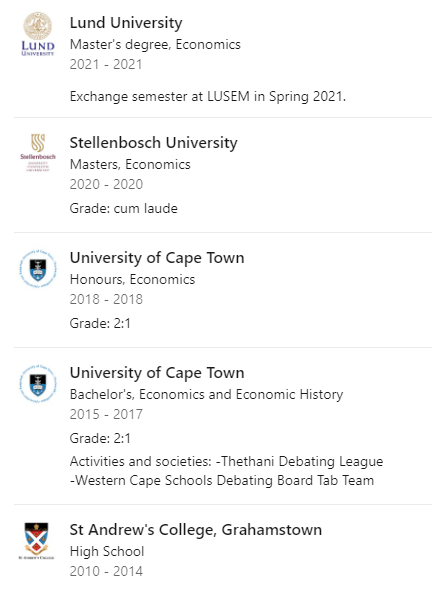

```{r setup, include=FALSE}
knitr::opts_chunk$set(echo = TRUE)

```

## Purpose

Katherine asked me if she could include the university logo in her education section on the about page on [her website](https://katherinebrown.org/). The about page is made with the [**postcards** package](https://github.com/seankross/postcards). I didn't know how to do it but thought that a table might make the most sense.

I really liked the style of the LinkedIn education sections:

```{r, out.width="50%", fig.cap="LinkedIn screenshot"}

```


In this post I walk through recreating this table with the [**gt** package](https://gt.rstudio.com/) in R.

## Where to begin?

The education section in the LinkedIn table has six components for each entry. They are:

1. A logo photo
1. A hyperlink to the institution though the image
1. Name of the institution (in bold)
1. Title of the degree
1. Date (start and end year)
1. Grade or comment

Let's create a tibble with these components.

```{r, code_folding = F}
library(tidyverse)

education <- tribble(
  ~logo, ~link, ~institution, ~degree, ~date, ~grade_comment,
  # LU
  "images/lu.jfif", "https://ehl.lu.se/ekonomisk-historia", "Lund University", "Master's degree, Economics", "2021", "Exchange semester",
  # SU
  "images/su.jfif", "https://www.ekon.sun.ac.za/", "Stellenbosch University", "Master's degree, Economics", "2020", "Grade: <em>cum laude</em>",
  # uct hnours
  "images/uct.jfif", "http://www.economics.uct.ac.za/", "University of Cape Town", "Honours degree, Economics", "2018", "Grade: 2:1",
  # uct undergrad
  "images/uct.jfif", "http://www.economics.uct.ac.za/", "University of Cape Town", "Bachelor's degree, Economics and Economic History", "2015-2017", "Grade: 2:1",
)
```

## Building the table

Now lets start on the table structure. What we're gonna do is take the individual pieces and format them to html, then stick the text together in one cell and the logos/links in another.

```{r, code_folding = F}
education <- education %>%
  mutate(
    logo = glue::glue("<a href = {link}>
                        
                      </a>"),
    institution = glue::glue("<b>{institution}</b>"),
    date = glue::glue("<span style='opacity: .7;'> {date} </span>"),
    grade_comment = glue::glue("<span style='opacity: .7;'> {grade_comment} </span>"),
  )
```

In the cell above we create an image tag for the logo, putting a hyperlink tag for the link to the university website inside it. Here we use the [**glue** package](https://glue.tidyverse.org/) which is useful for working with strings constructed from other columns. You can think of it as *gluing* together the html tag parts and the content from our dataframe. Next we put the institution in bold, and grey out the dates and grades with the html style tag, `'opacity: .7;'`.^[We opt to use the `<span>` tag rather than the `<p>` tag because `<span>` does not introduce any extra space.]

Now we can stick these text components together into one cell (just called text) and keep only the logo and text columns.^[We use `str_c` from the **stringr** package for its nice syntax, we could have used glue here again] Finally we use the map function from the [**purrr** package](https://purrr.tidyverse.org/) to transform the character strings into html. Printing the tibble shows that it now contains html elements inside each cell. 

```{r, code_folding = F}
education <- education %>%
  mutate(text = str_c(
    institution, "<br>",
    degree, "<br>",
    date, "<br>",
    grade_comment
  )) %>%
  select(logo, text) %>%
  mutate(
    logo = purrr::map(logo, gt::html),
    text = purrr::map(text, gt::html)
  )

education
```

Now we create the table by calling the gt() command.

```{r}
library(gt)

education %>% 
    gt()
```

Great, there it is! 

## Finalizing the table

We still want to make some changes to tidy it up a bit:

1. Adding a table header
1. Aligning the text to the left
1. Removing the column labels

```{r}
education %>%
  gt() %>%
  tab_header(md("**Education**")) %>%
  cols_align(align = c("left"), columns = text) %>%
  cols_label(
    logo = "",
    text = "",
  )
```

Lovely! Now we have the table we can use in the about page of a blog or personal website, with nice clickable logos that take you to the website of the institution. 

