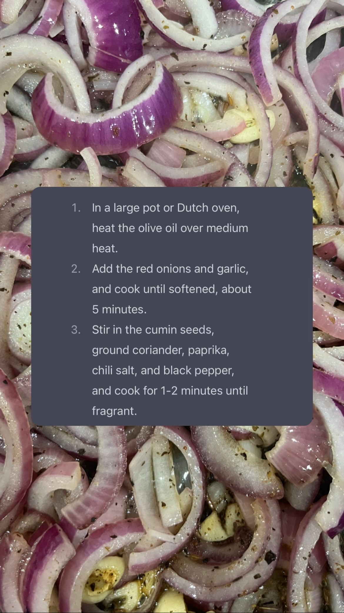
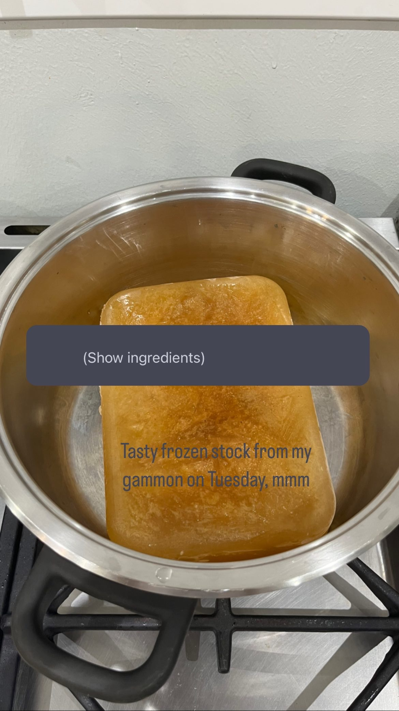
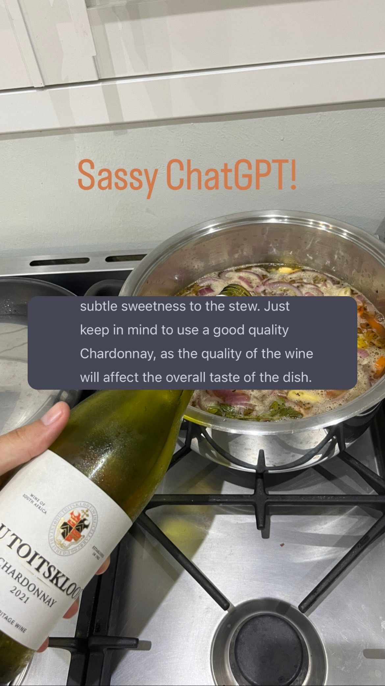

```{r setup, include=FALSE}
knitr::opts_chunk$set(echo = FALSE)
```

### Intro

I ask ChatGPT to help my cook dinner based on the ingredients I had in the fridge - it was a great success!

Have a look below at how it went! 

I also asked it to write this blog post, the output for which I include below.

### Process











### Suggested blog post text

Cooking is always a fun and creative experience, but sometimes it can be challenging to come up with new and exciting recipes. That's why having a helpful tool like ChatGPT can make a big difference in the kitchen.

Recently, I had the opportunity to put ChatGPT to the test as a cooking assistant. I provided a list of ingredients that I had on hand and asked for a recipe suggestion. ChatGPT quickly came up with a recipe for a Gammon and Vegetable Stew with Mint, along with detailed instructions for cooking the dish.

I was impressed with the speed and accuracy of ChatGPT's suggestion, and even more impressed with the quality of the recipe. The stew turned out to be delicious, hearty, and comforting - exactly what I was looking for on a cold winter day.

But ChatGPT's assistance didn't stop there. I asked if I could add a splash of Chardonnay to the stew and ChatGPT not only gave me a positive response, but also provided instructions on when and how to add the wine, along with a reminder to use a good quality Chardonnay to enhance the overall taste of the dish.

Overall, my experience with ChatGPT as a cooking assistant was extremely positive. It was able to provide me with a recipe and instructions that resulted in a delicious and satisfying meal. I was impressed with its speed, accuracy, and helpful suggestions, and I would definitely use ChatGPT again for recipe ideas and cooking instructions.

### Conclusion

What an amazing tool!
